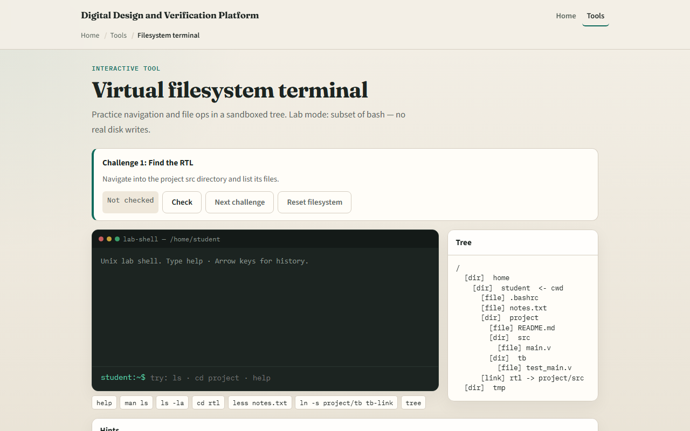
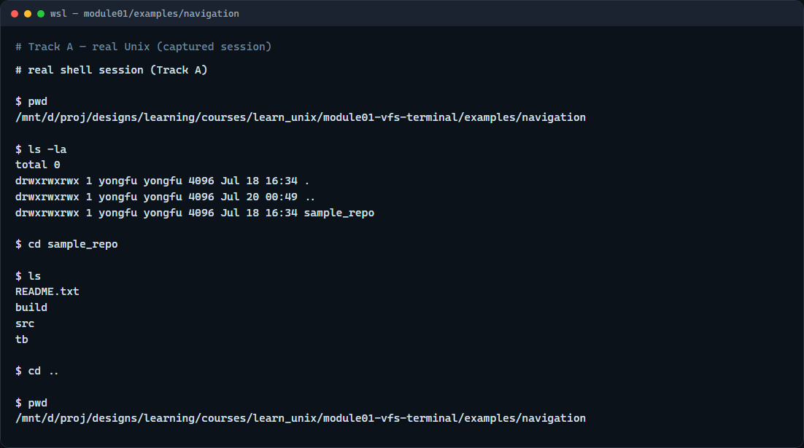

# Module 01 — Virtual filesystem terminal

**Module id:** module01-vfs-terminal  
**Lab:** vfs-terminal  
**Tracks:** A · B

## Slide 1 — Virtual filesystem terminal

This module is your first real practice: moving around a directory tree and listing what is there. In design work you will do this constantly—open a project, find the RTL folder, peek at a testbench, then jump back. We will use the browser lab for intuition, then the same ideas on a real shell.

## Slide 2 — The shell has a current directory

A terminal session always has a current working directory. Print it with the print-working-directory command. Change it with change-directory. List what is here with the list command. Relative paths are resolved against where you are now; that is why the same short path can succeed in one place and fail after you move.

## Slide 3 — Browser lab



In the browser lab, look at three pieces: the challenge card, the sandboxed prompt, and the tree on the side. Start the first challenge, try a list or a change-directory, then use Check when you think you are done. You do not need a full tour here—the lab itself guides the rest. Explore a few challenges, then come back for the real shell track.

## Slide 4 — Real shell practice



In the real Unix track, open this module’s navigation example in your terminal. Print the working directory, list with a long listing, step into the sample project folder, then move back up. Those three moves—where am I, what is here, go somewhere—are the muscle you will reuse in every later module, including when you run simulators like Icarus and Verilator. More trees live under this module’s examples folder when you want extra practice.

```bash
pwd
ls -la
cd sample_repo
ls
cd ..
```

## Slide 5 — Pitfalls to watch

Do not confuse a directory name with a file name when you change directories. Remember that a leading slash starts from the filesystem root, while a plain name is relative to where you are. Hidden files start with a dot and may not show unless you ask for them. And remember: the browser lab is for literacy—scripts you keep still belong on a real shell.

## Slide 6 — Your turn

Complete the checklist for at least one track—preferably both. In the browser, finish a few challenges after the starter. On the real shell, work through the navigation example, then try listing and a short peek at one of the viewing sample files. When you are ready, take the short quiz, then continue to the next module on discovering help with man and help flags.
