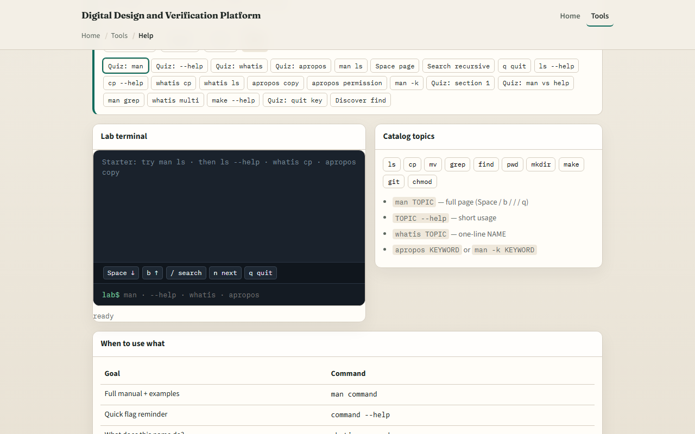
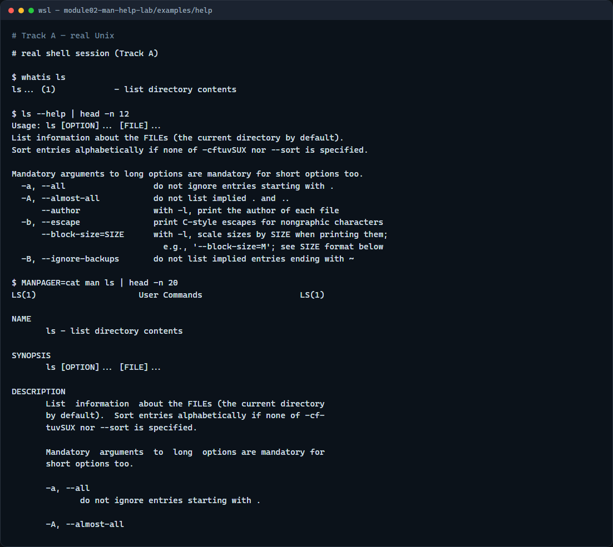

# Module 02 — man / --help discoverability

**Module id:** module02-man-help-lab  
**Lab:** man-help-lab  
**Tracks:** A · B

## Slide 1 — man / --help discoverability

You will not memorize every flag. Design work throws new tools at you—simulators, Make, Git—and the shell already has a way to look them up. This module is about discovering help: the manual, short help text, and a couple of search helpers.

## Slide 2 — Four ways to ask for help

Use man when you want the full manual page for a command. Use a help flag—often two dashes help—when you need a short usage reminder. Use whatis for a one-line summary of what a command is. Use apropos when you remember the idea but not the command name; it searches short descriptions by keyword. Pick the lightest tool that answers your question, then go back to work.

## Slide 3 — Browser lab



In the browser lab, load the starter example. You will see a sandboxed prompt and a challenge card. Try man on a topic to open a short manual, page through it, quit, then compare with a help flag on the same command. The lab is not a full system manual database—it teaches the habit. Explore a few challenges, then switch to a real shell.

## Slide 4 — Real shell practice



In the real Unix track, open this module’s help example folder. First run whatis on ls to get a one-line description of list. Next run ls with the help flag and pipe the first lines through head so you only skim the short usage text. Then open the man page for ls with MANPAGER set to cat so the manual prints instead of trapping you in an interactive viewer, and again take only the first lines with head. These same lookups will matter when you meet Icarus, Verilator, and Make later—help first, then flags.

```bash
# whatis — one-line summary of a command
whatis ls

# ls --help — short usage / flags; head keeps the first lines
ls --help | head -n 12

# man — full manual; MANPAGER=cat prints instead of interactive pager
MANPAGER=cat man ls | head -n 20
```

## Slide 5 — Pitfalls to watch

Not every command has a man page on every machine—WSL and minimal images sometimes ship thin documentation. Some tools use a help flag; others use a different switch. Interactive man viewers need a quit key, or they feel “stuck.” And remember: the browser lab builds intuition; your real projects still need a real shell.

## Slide 6 — Your turn

Complete the checklist for at least one track—preferably both. In the browser, finish a few challenges after the starter. On the real shell, run through the help example: whatis, help text, and a man skim when available. When you are ready, take the short quiz, then continue to absolute versus relative paths.
