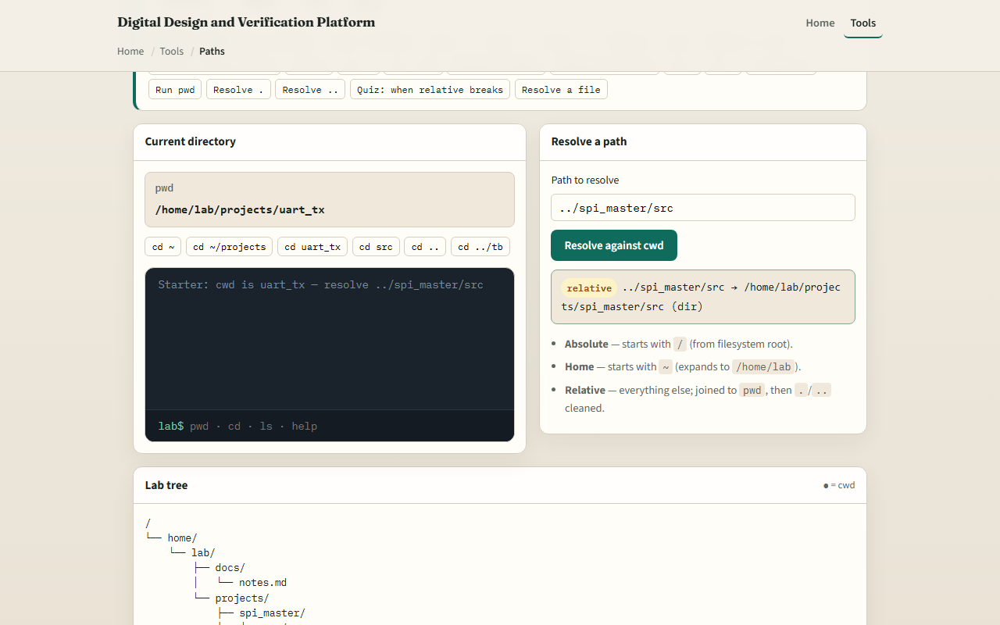
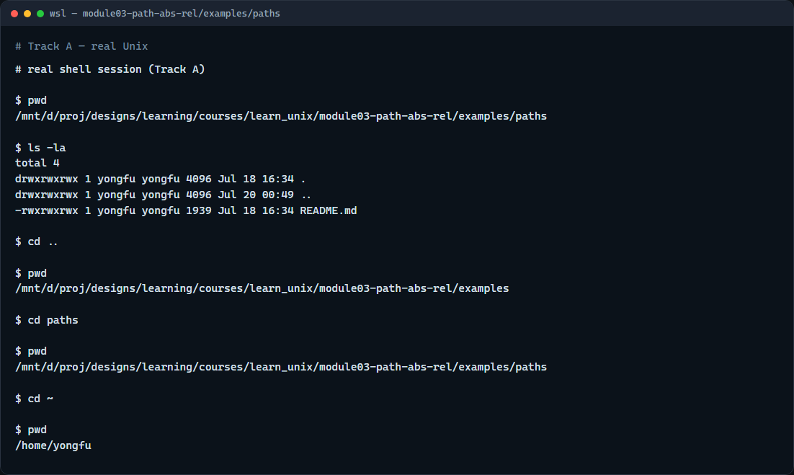

# Absolute vs relative paths

Paths are how you tell the shell where to go

---

## Absolute vs relative
- An absolute path starts from the filesystem root
- A relative path is resolved against your current working directory

---

## Browser lab


---

## Real shell practice


---

## Real shell practice — try these

```
# pwd — print working directory (absolute path of “here”)
pwd

# ls -la — list this folder so you see what relative names refer to
ls -la

# cd .. — relative: move up one directory
cd ..

# pwd — confirm where you landed after the relative move
pwd

# cd paths — relative: enter this folder by name from here
cd paths

# cd ~ — go to your home directory (tilde expands to home)
cd ~

# pwd — home’s absolute path
pwd

```

---

## Pitfalls to watch
- A relative path is not “wrong”, it is just tied to where you are now
- After change-directory, the same short path may fail
- Leading slash means from the root; tilde means home
- And remember

---

## Your turn
- Complete the checklist for at least one track, preferably both
- In the browser, finish a few challenges after the starter
- On the real shell
- When you are ready, take the short quiz, then continue to globs and wildcards

