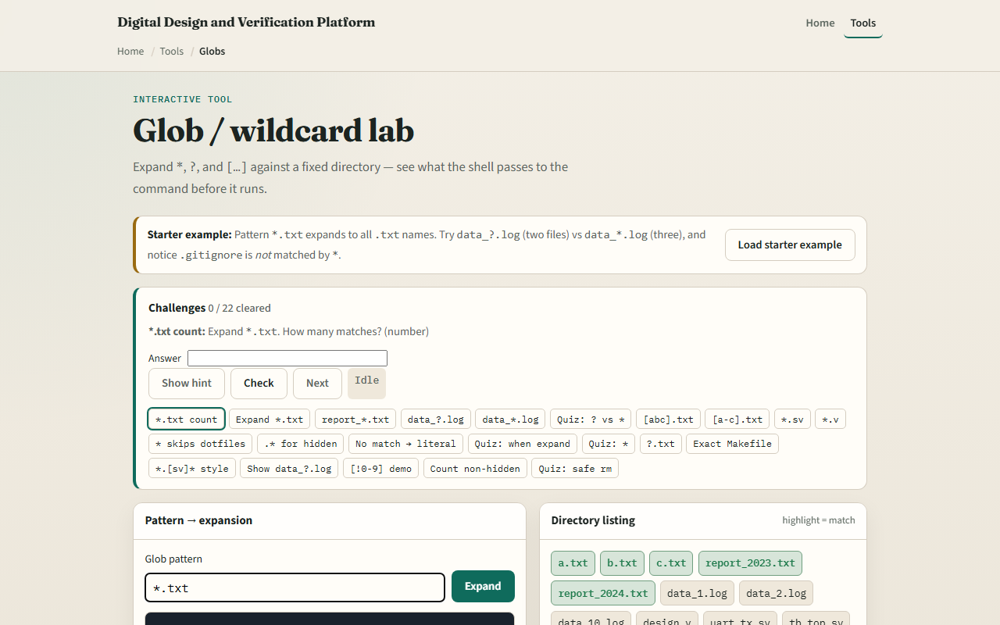
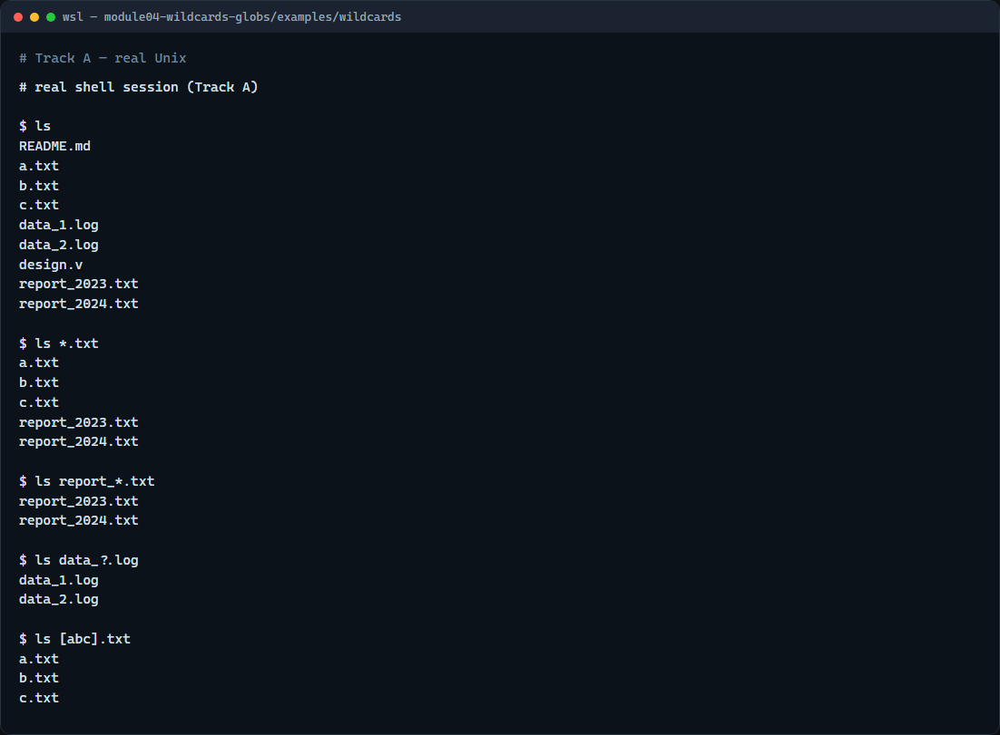

# Globs & wildcards

When you work with many Verilog files or log files, you do not want to type every name

---

## Star, question mark, brackets
- Star matches any sequence of characters
- Question mark matches exactly one character, handy for data underscore question-mark log
- Brackets match one character from a set or a range, like a, b, or c in square brackets
- The shell expands these patterns first; the command only sees the resulting names

---

## Browser lab


---

## Real shell practice


---

## Real shell practice — try these

```
# ls — see every name in this folder first
ls

# ls *.txt — star matches any sequence; list all .txt files
ls *.txt

# ls report_*.txt — star after a prefix; only report_… text files
ls report_*.txt

# ls data_?.log — question mark matches exactly one character
ls data_?.log

# ls [abc].txt — brackets: one character from the set a, b, or c
ls [abc].txt

```

---

## Pitfalls to watch
- The shell expands the pattern before the command runs
- If nothing matches, bash may leave the pattern literal
- Always list a destructive pattern first
- And remember

---

## Your turn
- Complete the checklist for at least one track, preferably both
- In the browser, finish a few challenges after the starter
- On the real shell, practice star, question mark
- When you are ready, take the short quiz, then continue to file types and links

