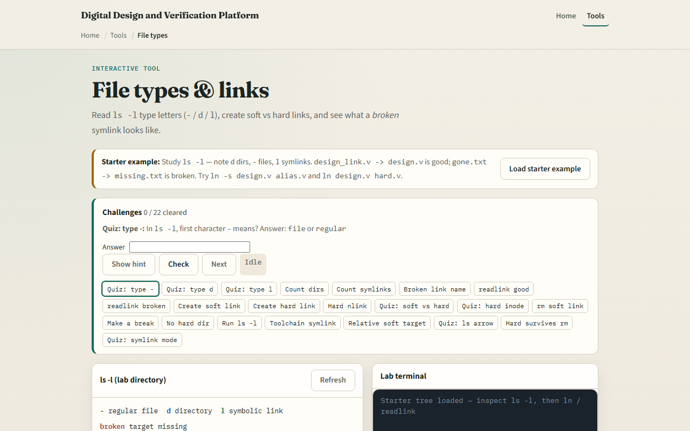
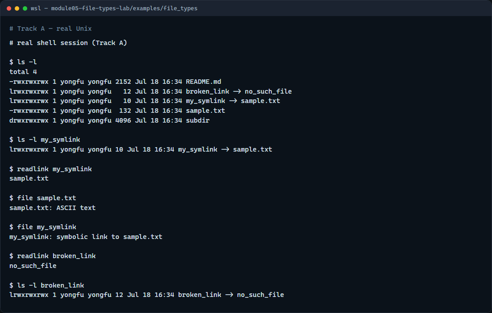

# File types & links

Not every name in a directory is the same kind of thing

---

## Dash, dee, and ell
- In a long listing, the first character is the type
- A dash means a regular file
- The letter d means a directory
- The letter l means a symbolic link, and the listing often shows an arrow to the target
- Soft links are names that point at another path

---

## Browser lab


---

## Real shell practice


---

## Real shell practice — try these

```
# ls -l — long listing; first character is the type (-, d, or l)
ls -l

# ls -l my_symlink — inspect the working symlink line (arrow to target)
ls -l my_symlink

# readlink my_symlink — print the path the symlink points to
readlink my_symlink

# file sample.txt — classify the regular file
file sample.txt

# file my_symlink — classify the symlink (follows or reports the link)
file my_symlink

# readlink broken_link — target path even when the target is missing
readlink broken_link

# ls -l broken_link — see the broken symlink in the long listing
ls -l broken_link

```

---

## Pitfalls to watch
- Removing a symlink with remove deletes the link name
- Do not confuse a broken link with “nothing there”: readlink still prints a path
- And remember

---

## Your turn
- Complete the checklist for at least one track, preferably both
- In the browser, finish a few challenges after the starter
- On the real shell, practice long listing, readlink, and spotting a broken link
- When you are ready, take the short quiz, then continue to realpath and resolving paths

