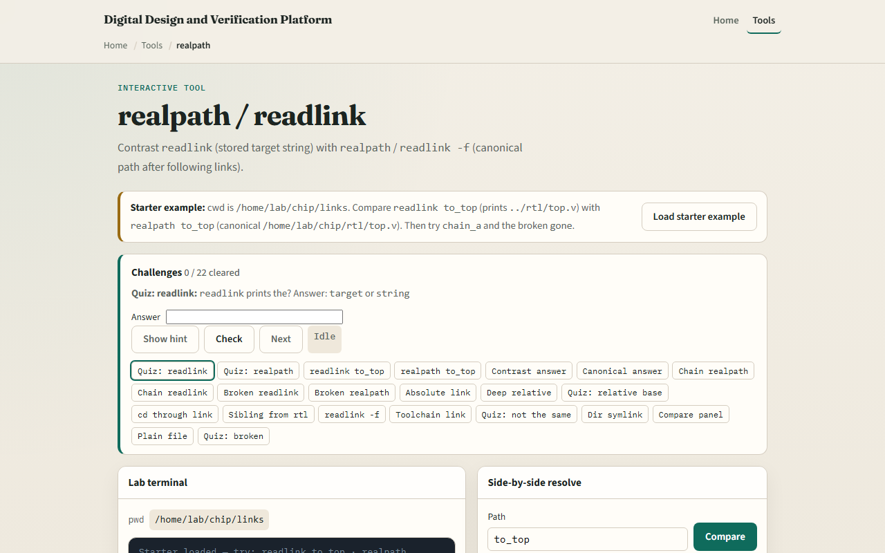
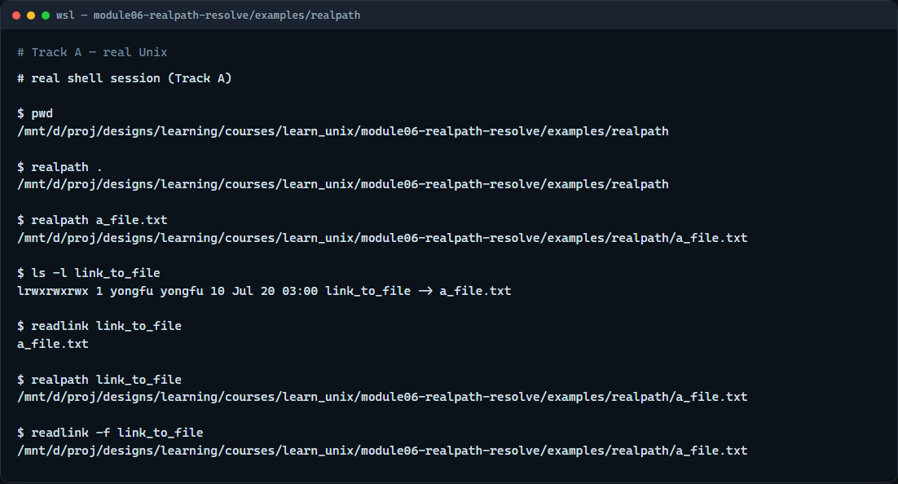

# realpath / readlink

Relative paths and symlinks are handy, until a script needs one clear absolute location

---

## Stored target vs canonical path
- Readlink on a symlink prints the stored target string, often a short relative path
- Realpath (and readlink with a force-style flag on Linux) cleans dots and parent segments
- That difference matters in build scripts

---

## Browser lab


---

## Real shell practice


---

## Real shell practice — try these

```
# pwd — where you are before resolving
pwd

# realpath . — absolute canonical path of the current directory
realpath .

# realpath a_file.txt — absolute path of the sample file
realpath a_file.txt

# ls -l link_to_file — see the symlink arrow to the file
ls -l link_to_file

# readlink link_to_file — stored target string (often relative)
readlink link_to_file

# realpath link_to_file — follow the link to a canonical absolute path
realpath link_to_file

# readlink -f link_to_file — Linux-style canonical path (same idea as realpath)
readlink -f link_to_file

```

---

## Pitfalls to watch
- A broken link still has a stored string
- Do not assume every system has the same readlink flags
- And remember

---

## Your turn
- Complete the checklist for at least one track, preferably both
- In the browser, finish a few challenges after the starter
- On the real shell, compare readlink’s stored target with realpath’s canonical path
- When you are ready, take the short quiz, then continue to permissions, umask, and PATH

