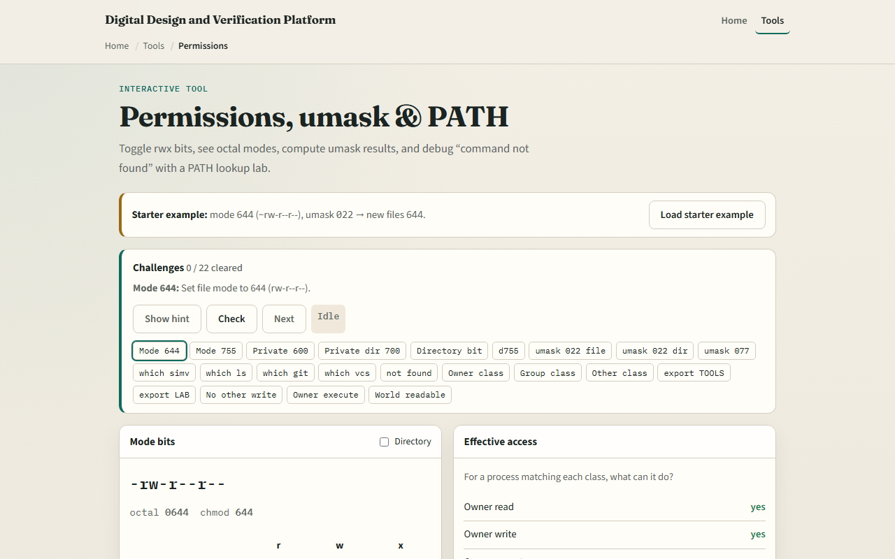
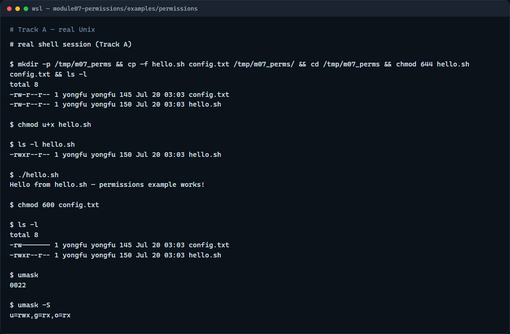

# Module 07 — Permissions, umask, PATH

**Module id:** module07-permissions  
**Lab:** permissions  
**Tracks:** A · B

## Slide 1 — Permissions, umask, PATH

Who can read a file, who can run a script, and which command the shell finds first—those three ideas show up every day in design work. Permissions gate access. umask sets defaults for new files. PATH decides where the shell looks for tools. This module ties them together so chmod and “command not found” feel less mysterious.

## Slide 2 — Mode bits, umask, and PATH

In a long listing, the nine permission letters are user, group, and others—each with read, write, and execute. chmod changes those bits; a script needs execute before you can run it with dot-slash. umask masks bits off new files so you do not accidentally create world-writable junk. PATH is a colon-separated search list—your current directory is usually not on it, which is why you type dot-slash for a local script.

## Slide 3 — Browser lab



In the browser lab, load the starter example. Flip a mode and watch the symbolic string. Try an umask and see what a new file would get. Glance at the PATH panel and which-command lookup. Orient yourself across those three panels, try a few challenges, then practice on a real shell.

## Slide 4 — Real shell practice



In the real Unix track, open this module’s permissions example. List the files in long format. Add execute for your user on the hello script, list again, then run it with dot-slash. Tighten the config file to owner-only with a numeric mode. Print umask in numeric and symbolic form so you see the default mask for new files. You will reuse chmod and PATH habits with real toolchains later.

```bash
# ls -l — long listing; read the nine permission letters
ls -l

# chmod u+x hello.sh — add execute for your user (symbolic mode)
chmod u+x hello.sh

# ls -l hello.sh — confirm the user execute bit appears
ls -l hello.sh

# ./hello.sh — run the script in this directory (dot is usually not on PATH)
./hello.sh

# chmod 600 config.txt — owner read/write only (numeric mode)
chmod 600 config.txt

# ls -l — see both the script and the tightened config
ls -l

# umask — show the numeric default mask for new files
umask

# umask -S — same mask in symbolic form
umask -S
```

## Slide 5 — Pitfalls to watch

Avoid chmod seven-seven-seven unless you truly understand the risk. Prefer user-plus-execute for scripts you own. Remember: without dot-slash, the shell searches PATH and may say “command not found” even when the file is right here. And remember: the browser lab shows the idea; real projects still need correct modes on a real shell.

## Slide 6 — Your turn

Complete the checklist for at least one track—preferably both. In the browser, finish a few challenges after the starter. On the real shell, practice chmod, umask, and running a local script with dot-slash—then explore the other example folders when you want more depth. When you are ready, take the short quiz, then continue to dotfiles and config homes.
