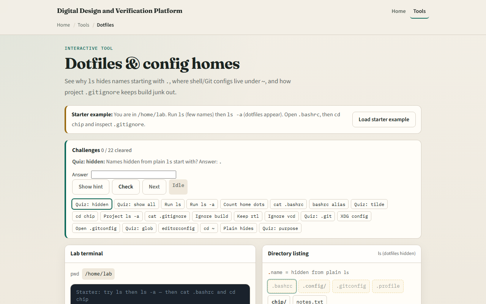
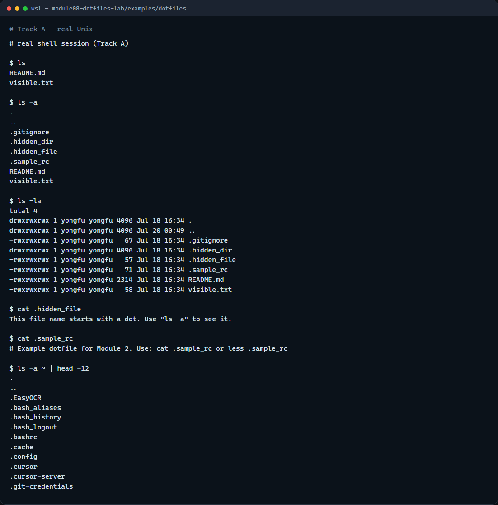

# Dotfiles & config homes

Names that start with a dot are usually hidden from a plain list

---

## Hidden names and home config
- A plain list shows only visible names
- Add all-files mode and the dots appear
- Home is full of them
- Projects add their own, especially the git directory and ignore rules
- Listing with all-files is the first habit; editing comes later

---

## Browser lab


---

## Real shell practice


---

## Real shell practice — try these

```
# ls — plain list; dot-names stay hidden
ls

# ls -a — show all names, including those starting with a dot
ls -a

# ls -la — long listing that includes hidden names
ls -la

# cat .hidden_file — read a hidden file (safe inspect)
cat .hidden_file

# cat .sample_rc — read an example config-style dotfile
cat .sample_rc

# ls -a ~ | head -12 — peek at real home dotfiles (read-only)
ls -a ~ | head -12

```

---

## Pitfalls to watch
- Do not edit bashrc or profile until you understand the change, a typo can break new shells
- Prefer read tools first: cat or less
- Remember that star globs often skip leading-dot names unless you ask for them
- And remember

---

## Your turn
- Complete the checklist for at least one track, preferably both
- In the browser, finish a few challenges after the starter
- On the real shell, practice plain list versus list-all
- When you are ready, take the short quiz, then continue to process list and signals

