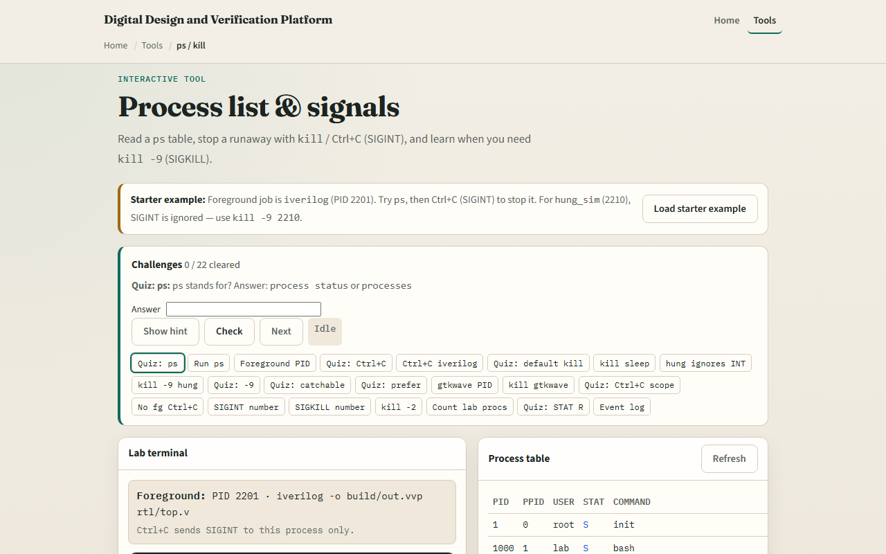
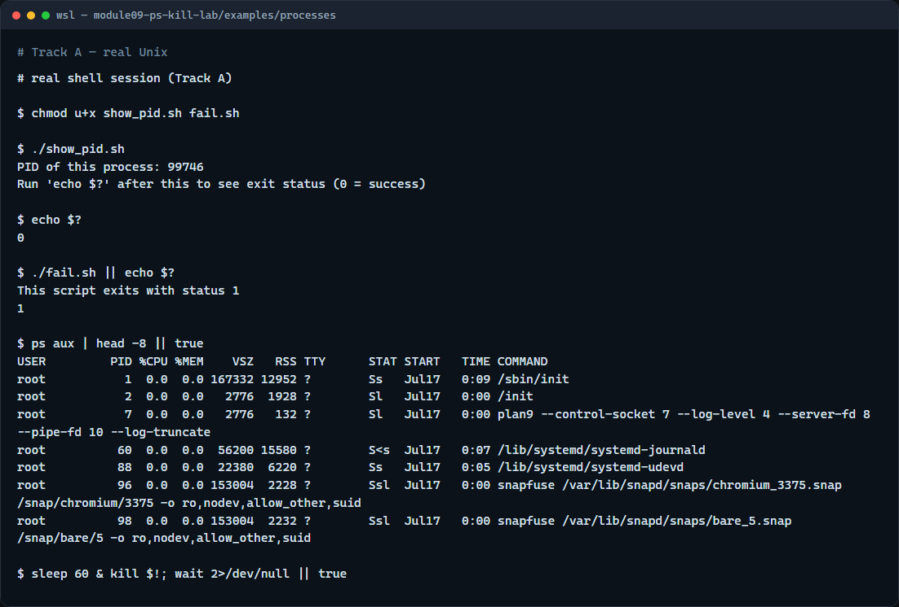

# Module 09 — Process list & signals

**Module id:** module09-ps-kill-lab  
**Lab:** ps-kill-lab  
**Tracks:** A · B

## Slide 1 — Process list & signals

When a build or simulation hangs, you need to see what is running and how to stop it. Every running program is a process with an ID. You list processes, send signals to ask them to exit, and read exit status to know whether a command succeeded. This module makes those habits concrete.

## Slide 2 — PID, exit status, and signals

A process ID uniquely names a running program. When a command finishes, it leaves an exit status—zero usually means success; anything else means failure. Signals are how you interrupt or stop a process: interrupt is what Control-C sends in the foreground; terminate asks politely; kill nine is the last resort that cannot be caught. Background jobs need kill with a PID—Control-C alone will not stop them.

## Slide 3 — Browser lab



In the browser lab, load the starter example. List the fake process table. Try Control-C on a catchable job, then use kill nine on the hung simulation that ignores interrupt. Orient yourself with the process list and the signal cards, try a few challenges, then practice on a real shell.

## Slide 4 — Real shell practice



In the real Unix track, open this module’s processes example. Make the scripts executable if needed. Run the show-PID script and print the exit status—you should see success. Run the fail script and print the status again—you should see failure. List a few system processes with ps. Start a short sleep in the background, note its PID, then kill it so you practice stopping a background job safely.

```bash
# chmod u+x … — ensure the demo scripts are executable
chmod u+x show_pid.sh fail.sh

# ./show_pid.sh — run a script that prints its PID and exits successfully
./show_pid.sh

# echo $? — print the last exit status (0 = success)
echo $?

# ./fail.sh — run a script that exits with status 1
./fail.sh

# echo $? — confirm a non-zero failure status
echo $?

# ps aux | head -8 — list a few processes (USER, PID, COMMAND, …)
ps aux | head -8

# sleep 60 & — start a background job; kill it by PID (safe practice)
sleep 60 &
kill $!
```

## Slide 5 — Pitfalls to watch

Do not kill processes you do not own or understand—especially not with kill nine as a first move. Prefer terminate, then escalate only if needed. Remember that Control-C stops the foreground job, not an arbitrary background PID. And remember: the browser lab shows the idea; stuck simulators and builds still need real ps and kill on a real shell.

## Slide 6 — Your turn

Complete the checklist for at least one track—preferably both. In the browser, finish a few challenges after the starter. On the real shell, practice exit status, listing processes, and killing a background sleep you started yourself. When you are ready, take the short quiz, then continue to job control.
