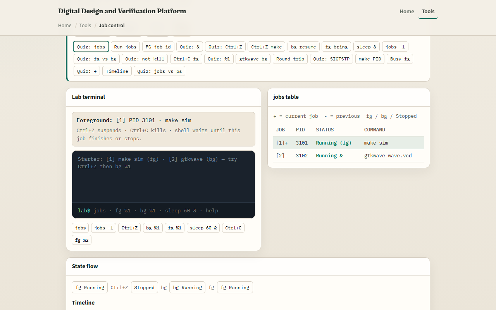
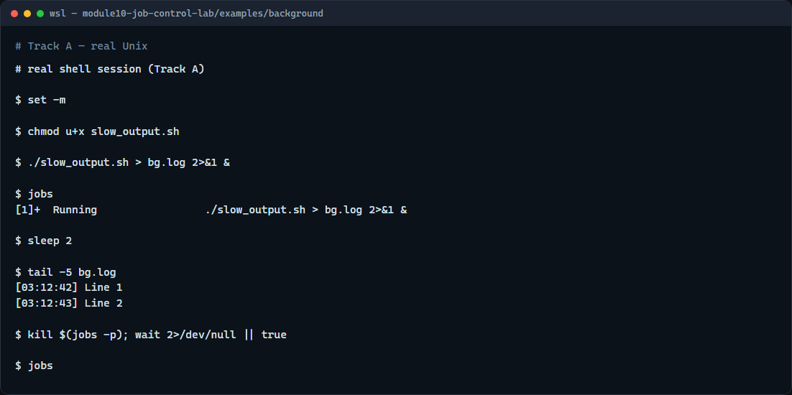

# Module 10 — Job control

**Module id:** module10-job-control-lab  
**Lab:** job-control-lab  
**Tracks:** A · B

## Slide 1 — Job control

Long builds and simulations should not lock your terminal forever. Job control lets you start work in the background, list what this shell is running, suspend with Control-Z, and bring a job back with foreground or background. This module connects ampersand, jobs, fg, and bg to habits you will use on real projects.

## Slide 2 — Background, stop, and resume

An ampersand at the end of a command starts it in the background—you get the prompt back. jobs lists this shell’s jobs. Control-Z suspends the foreground job; it is stopped, not killed. bg resumes a stopped job in the background; fg brings a job to the foreground so you can interact or interrupt with Control-C. Redirect output to a log, then tail the log while the job runs.

## Slide 3 — Browser lab



In the browser lab, load the starter example. Watch the jobs table and the foreground banner. Try Control-Z on a running foreground job, then bg or fg. Start something with ampersand and list jobs. Orient yourself with the state diagram, try a few challenges, then practice on a real shell.

## Slide 4 — Real shell practice



In the real Unix track, open this module’s background example. Make the slow script executable. Start it in the background with output redirected to a log. List jobs so you see the job number and PID. Wait a moment, then show the last lines of the log. Stop the background job when you are done practicing. You will reuse this pattern for long sims and builds.

```bash
# chmod u+x slow_output.sh — make the demo script executable
chmod u+x slow_output.sh

# ./slow_output.sh > bg.log 2>&1 & — run in background; stdout/stderr to a log
./slow_output.sh > bg.log 2>&1 &

# jobs — list this shell’s background jobs
jobs

# sleep 2 — give the script a moment to write lines
sleep 2

# tail -5 bg.log — show the latest log lines while the job runs
tail -5 bg.log

# kill %1 — stop job 1 (or: kill $(jobs -p))
kill %1
```

## Slide 5 — Pitfalls to watch

Control-Z stops; it does not terminate—use Control-C or kill when you want the process gone. jobs only lists jobs for this shell, not every process on the machine. Closing the terminal can hang or kill background jobs unless you plan for that. And remember: the browser lab shows the idea; real sims still need background jobs and logs on a real shell.

## Slide 6 — Your turn

Complete the checklist for at least one track—preferably both. In the browser, finish a few challenges after the starter. On the real shell, practice ampersand, jobs, and tailing a log. When you are ready, take the short quiz, then continue to pipes, redirection, and xargs.
