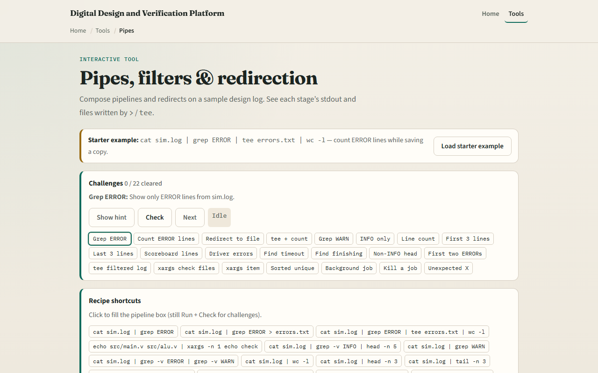
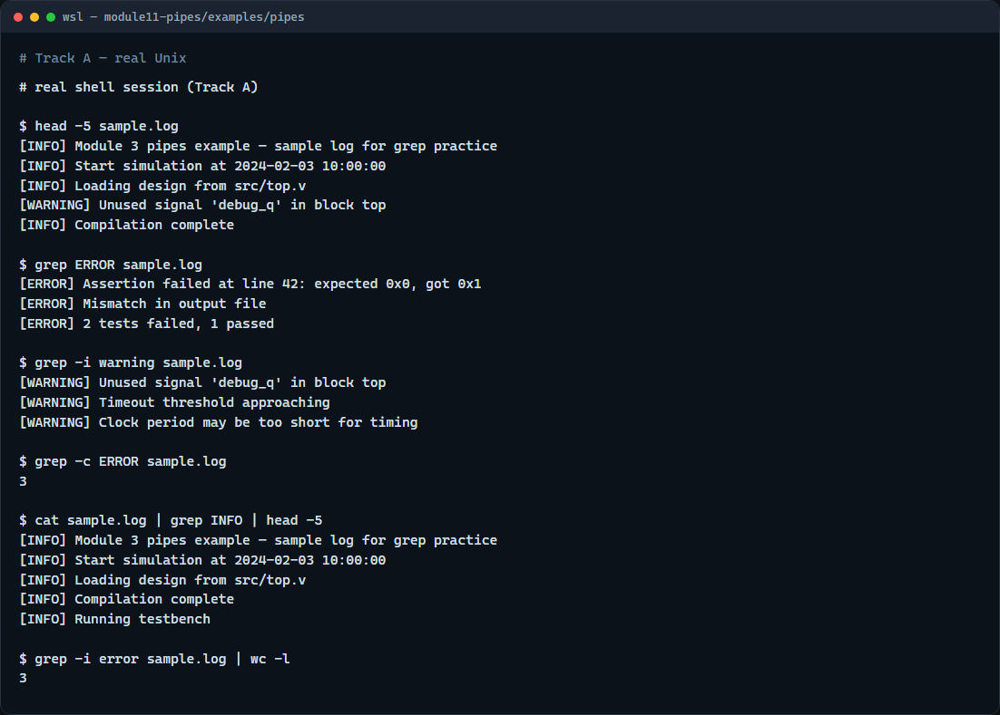

# Module 11 — Pipes, redirection, xargs

**Module id:** module11-pipes  
**Lab:** pipes  
**Tracks:** A · B

## Slide 1 — Pipes, redirection, xargs

Shell power often means connecting small tools. A pipe sends one command’s output into the next. Redirection writes that stream to a file—or merges error output with it. xargs turns a list of words into repeated command arguments. This module builds the muscle you need for log hunting and build debugging.

## Slide 2 — Pipe, redirect, and feed arguments

The vertical bar connects stdout of the left command to stdin of the right. Greater-than overwrites a file with stdout; two greater-thans append; two-greater-ampersand-one sends stderr along with stdout. xargs reads items from stdin and builds argument lists—handy when you have many filenames. Together they turn a noisy log into a short list of errors.

## Slide 3 — Browser lab



In the browser lab, load the starter example. The pipeline box often starts with cat into grep into tee into word-count—run it and watch the stages. Try a redirect challenge and an xargs challenge when you are ready. Orient yourself with the pipeline and the lab files panel, try a few checks, then practice on a real shell.

## Slide 4 — Real shell practice



In the real Unix track, open this module’s pipes example. Peek at the sample log. Search for ERROR lines, then search case-insensitive for warnings. Count ERROR lines. Pipe the log through grep for INFO and take the first few matches. Finally pipe error matches into word-count so you see a pipeline that answers “how many?” You will reuse this on real sim logs; explore the redirection and xargs folders when you want more depth.

```bash
# head -5 sample.log — peek at the start of the log
head -5 sample.log

# grep ERROR sample.log — lines containing ERROR
grep ERROR sample.log

# grep -i warning sample.log — case-insensitive warning lines
grep -i warning sample.log

# grep -c ERROR sample.log — count matching lines
grep -c ERROR sample.log

# cat sample.log | grep INFO | head -5 — pipe: filter then take first five
cat sample.log | grep INFO | head -5

# grep -i error sample.log | wc -l — pipe: count error-like lines
grep -i error sample.log | wc -l
```

## Slide 5 — Pitfalls to watch

A pipe only carries stdout by default—stderr still goes to the terminal unless you redirect. Overwrite with one greater-than destroys the previous file; prefer append when you mean to keep history. And remember: the browser lab shows the idea; real builds still need pipes and redirects on a real shell.

## Slide 6 — Your turn

Complete the checklist for at least one track—preferably both. In the browser, finish a few pipeline challenges after the starter. On the real shell, practice grep and pipes on the sample log, then try the redirection and xargs examples. When you are ready, take the short quiz, then continue to sort, uniq, and cut.
