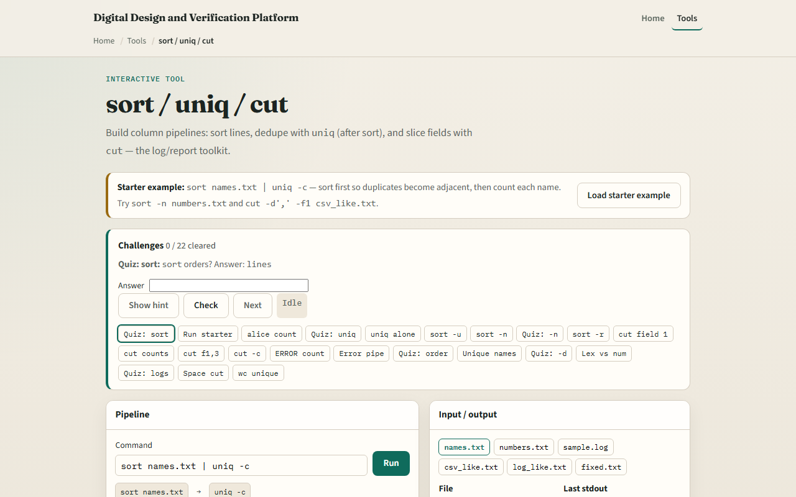
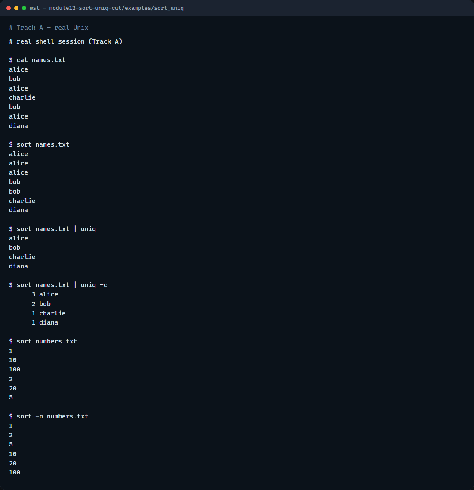

# Module 12 — sort / uniq / cut

**Module id:** module12-sort-uniq-cut  
**Lab:** sort-uniq-cut  
**Tracks:** A · B

## Slide 1 — sort / uniq / cut

Logs and lists are messy until you order them, collapse duplicates, and pull out columns. sort orders lines. uniq drops adjacent duplicates—so you almost always sort first. cut extracts fields by delimiter or character position. This module is the text-processing trio you will chain after grep.

## Slide 2 — Order, dedupe, and columns

Alphabetical sort is the default; numeric sort with dash-n puts ten after two, not before. uniq only collapses neighbors, so sort then uniq is the classic dedupe. uniq with dash-c prints a count beside each unique line—great for “how often did this error appear?” cut with a comma delimiter and field list pulls columns from CSV-like lines. Remember: uniq without sort misses scattered duplicates.

## Slide 3 — Browser lab



In the browser lab, load the starter example. The usual first pipeline is sort names into uniq with counts. Try a numeric sort on the numbers file, then cut the first field from the CSV-like file. Orient yourself with the terminal and the file list, try a few challenges, then practice on a real shell.

## Slide 4 — Real shell practice



In the real Unix track, open this module’s sort-uniq example. Show the names file with duplicates. Sort it, then sort into uniq, then sort into uniq with counts so you see frequencies. Sort the numbers file the default way—notice the wrong order—then sort numerically. When you want columns, use the cut-columns example with cut and a comma delimiter. You will reuse sort-pipe-uniq-count on real error logs.

```bash
# cat names.txt — see the raw list with duplicates
cat names.txt

# sort names.txt — alphabetical order (duplicates become adjacent)
sort names.txt

# sort names.txt | uniq — unique lines after sorting
sort names.txt | uniq

# sort names.txt | uniq -c — unique lines with occurrence counts
sort names.txt | uniq -c

# sort numbers.txt — default (lexicographic) order — often wrong for numbers
sort numbers.txt

# sort -n numbers.txt — numeric sort (1, 2, 5, 10, …)
sort -n numbers.txt
```

## Slide 5 — Pitfalls to watch

Running uniq alone on an unsorted file skips non-adjacent duplicates—sort first. Do not confuse lexicographic sort with numeric sort for version numbers or sizes. And remember: the browser lab shows the idea; real log analysis still needs these tools on a real shell.

## Slide 6 — Your turn

Complete the checklist for at least one track—preferably both. In the browser, finish a few challenges after the starter. On the real shell, practice sort, uniq dash-c, and numeric sort—then try cut on the cut-columns example. When you are ready, take the short quiz, then continue to here-documents and here-strings.
