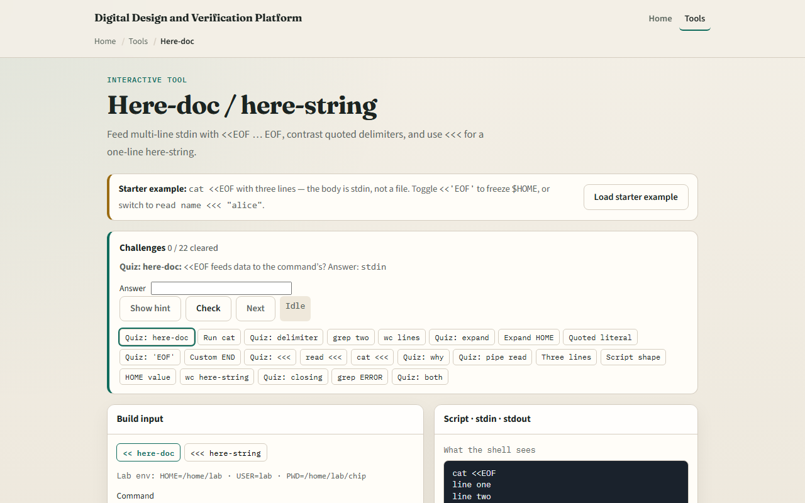
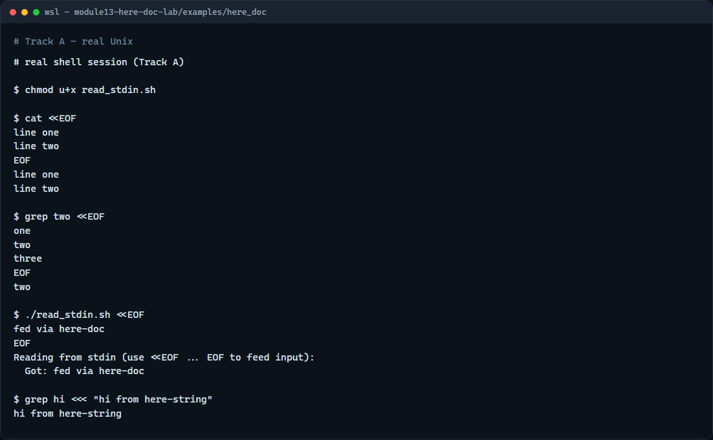

# Here-doc / here-string

Sometimes you need to feed a command several lines of input without creating a temp file

---

## Multi-line stdin vs one string
- Less-than less-than EOF starts a here-doc
- Leave the delimiter unquoted if you want variables expanded
- Three less-thans with a string is a here-string, one chunk of text as stdin
- Prefer these over awkward echo pipes when the reader must run in the current shell

---

## Browser lab


---

## Real shell practice


---

## Real shell practice — try these

```
# chmod u+x read_stdin.sh — make the stdin reader executable
chmod u+x read_stdin.sh

# cat <<EOF … EOF — here-doc: multi-line body becomes cat’s stdin
cat <<EOF
line one
line two
EOF

# grep two <<EOF … EOF — search inside a here-doc body
grep two <<EOF
one
two
three
EOF

# ./read_stdin.sh <<EOF … EOF — feed the script via here-doc
./read_stdin.sh <<EOF
fed via here-doc
EOF

# grep hi <<< "…" — here-string: one string as stdin
grep hi <<< "hi from here-string"

```

---

## Pitfalls to watch
- The closing delimiter must be alone on its line, no spaces, or the here-doc never ends
- Unquoted EOF expands variables; quoted EOF does not, pick deliberately
- And remember

---

## Your turn
- Complete the checklist for at least one track, preferably both
- In the browser, finish a few challenges after the starter
- On the real shell, practice a here-doc into cat and the reader script, plus a here-string
- When you are ready, take the short quiz, then continue to shell history and reverse-search

