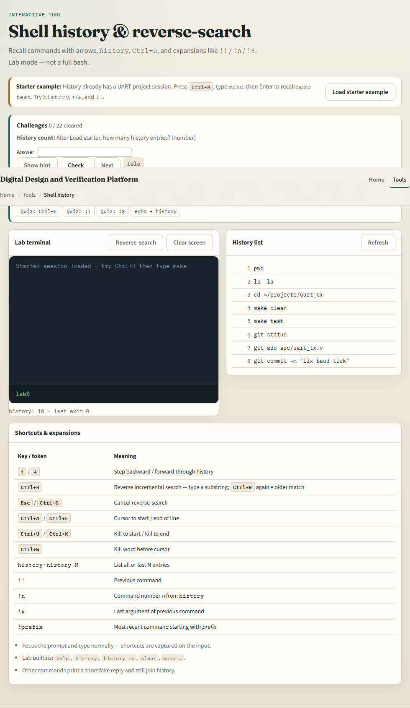
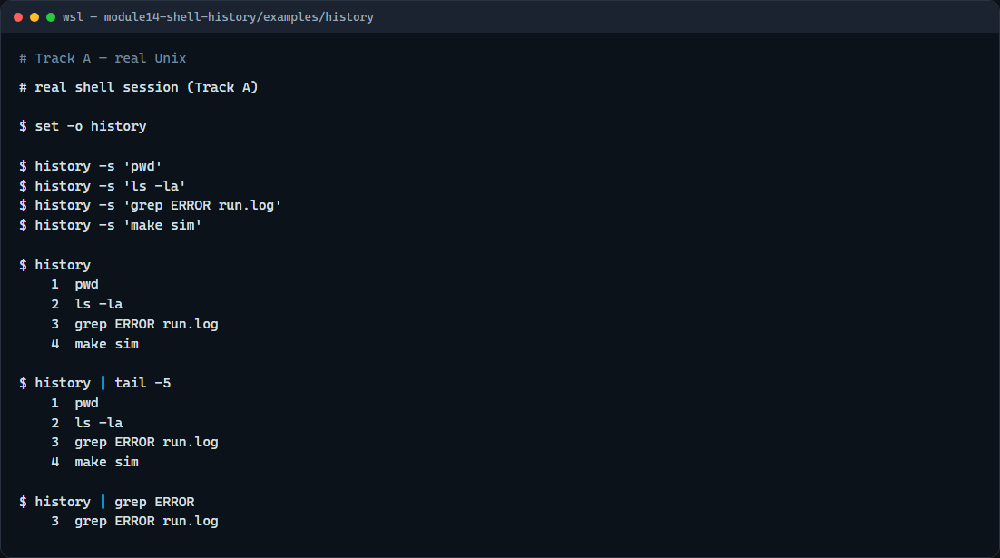

# Module 14 — Shell history & reverse-search

**Module id:** module14-shell-history  
**Lab:** shell-history  
**Tracks:** A · B

## Slide 1 — Shell history & reverse-search

You will type the same kinds of commands again and again—build, grep a log, change directories. Shell history remembers what you ran so you can recall, edit, and re-run without retyping. Reverse-search finds an older line by a substring. This module makes history and the keyboard shortcuts feel natural.

## Slide 2 — Recall, edit, re-run

Arrow up and arrow down step through previous commands. Ctrl+A and Ctrl+E jump to the start or end of the line; Ctrl+U and Ctrl+K clear toward the start or end. Ctrl+R starts reverse incremental search—type part of a past command, then Enter to run the match. The history builtin lists numbered entries; bang-bang re-runs the last command, and bang-number re-runs by index—use bang forms carefully. Faster recall means less friction when you iterate on simulators and scripts.

## Slide 3 — Browser lab



In the browser lab, load the starter example. Press reverse-search or use the button if the browser steals Ctrl+R, type make, and recall make test. Try history, the up and down arrows, and bang-bang. Orient yourself with the terminal, the history side panel, and the shortcut table, try a few challenges, then practice on a real shell.

## Slide 4 — Real shell practice



In the real Unix track, open this module’s history example folder. Turn history on for the session, seed a few typical commands, then list history so you see numbered lines. Pipe history into tail for the recent slice, then into grep to find a past grep or error search. On your own keyboard, practice arrow keys and Ctrl+R—those do not show in a static screenshot, but they are the daily muscle memory. You will reuse reverse-search whenever a long make or grep line is buried in the past.

```bash
# set -o history — enable history in this shell session
set -o history

# history -s … — add a line to history without running it (demo seed)
history -s 'pwd'
history -s 'ls -la'
history -s 'grep ERROR run.log'
history -s 'make sim'

# history — list numbered past commands
history

# history | tail -5 — show only the most recent entries
history | tail -5

# history | grep ERROR — find past commands that mention ERROR
history | grep ERROR
```

## Slide 5 — Pitfalls to watch

Bang-number and bang-bang re-execute immediately—double-check the line before you hit Enter on a destructive command. Reverse-search can feel sticky; Ctrl+C cancels cleanly. And remember: the browser lab teaches the muscle memory; lasting speed still comes from history and Ctrl+R on a real shell.

## Slide 6 — Your turn

Complete the checklist for at least one track—preferably both. In the browser, finish a few challenges after the starter. On the real shell, list history, search it with grep, and practice Ctrl+R until recall feels automatic. When you are ready, take the short quiz, then continue to aliases and functions.
