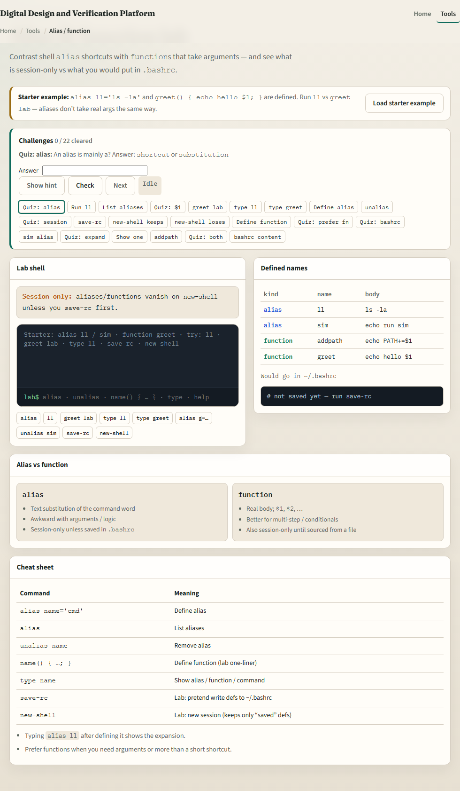
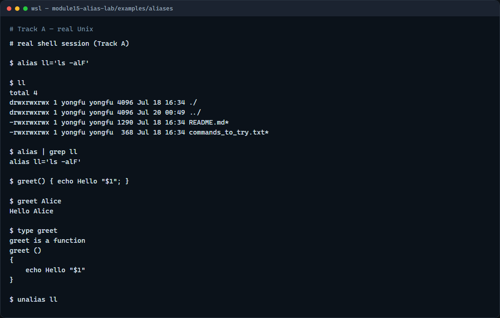

# Alias & functions

Typing the same long command again and again is slow

---

## Shortcut vs helper with args
- An alias expands to text before the shell runs the line
- Aliases are awkward with real arguments; prefer a function when you need `$1` or `"$@"`
- Functions run in the current shell, so they can change directory or set variables for you
- Scripts run in a subshell, better when you want a file to share and version
- Session aliases and functions vanish when the shell exits unless you add them to your

---

## Browser lab


---

## Real shell practice


---

## Real shell practice — try these

```
# alias ll='…' — define a session alias for a long listing
alias ll='ls -alF'

# ll — run the alias (expands to ls -alF)
ll

# alias | grep ll — list aliases and keep lines matching ll
alias | grep ll

# greet() { … } — define a function that uses the first argument
greet() { echo Hello "$1"; }

# greet Alice — call the function with one argument
greet Alice

# type greet — show whether greet is an alias, function, or command
type greet

# unalias ll — remove the ll alias from this session
unalias ll

```

---

## Pitfalls to watch
- Do not put spaces around the equals in `alias name='cmd'`
- Remember aliases do not take arguments the way functions do
- And remember

---

## Your turn
- Complete the checklist for at least one track, preferably both
- In the browser, finish a few challenges after the starter
- On the real shell, define an alias and a small function, then try `type` and `unalias`
- When you are ready, take the short quiz, then continue to script control flow

