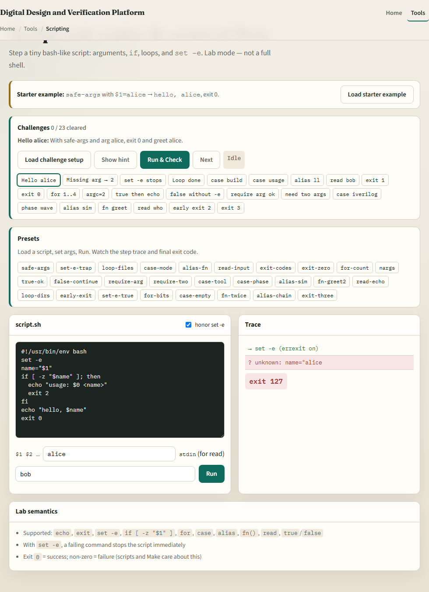
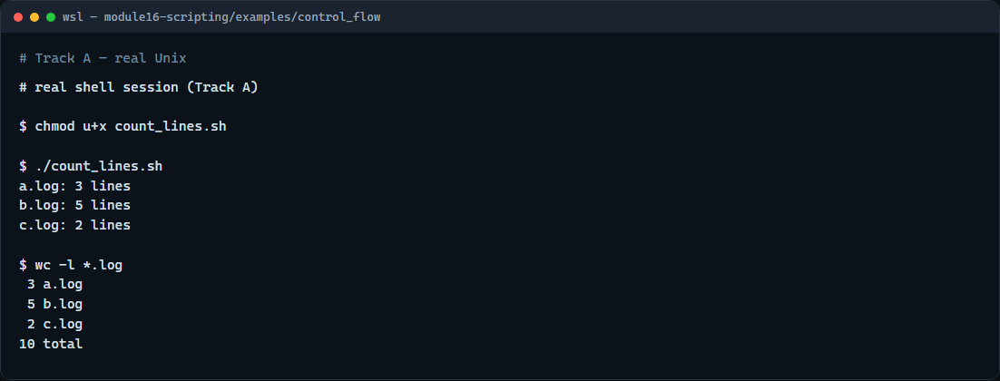

# Script control flow

A one-liner is fine until you need decisions and repetition

---

## If, for, and case
- An if test with brackets checks a condition, file exists, string empty
- A for loop walks a list, often a glob of files, and runs the body once per item
- A case statement matches one value against patterns and is cleaner than a long if-elif
- Quote variables, end case arms with double semicolon

---

## Browser lab


---

## Real shell practice


---

## Real shell practice — try these

```
# chmod u+x count_lines.sh — make the control-flow script executable
chmod u+x count_lines.sh

# ./count_lines.sh — for each *.log: if it is a file, print line count
./count_lines.sh

# wc -l *.log — compare: word-count lines on the same logs
wc -l *.log

```

---

## Pitfalls to watch
- Spaces matter inside test brackets, write `[ -f "$file" ]`, not jammed tokens
- Always quote `"$file"` and `"$1"` so names with spaces survive
- And remember

---

## Your turn
- Complete the checklist for at least one track, preferably both
- In the browser, finish a few challenges after the starter
- On the real shell, run the control-flow script and try arguments or case greet next
- When you are ready

