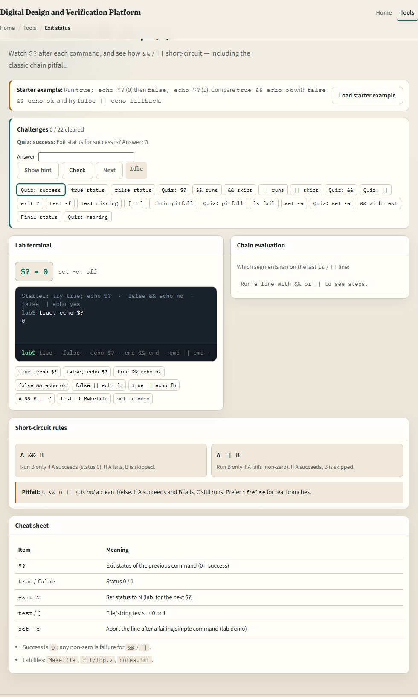
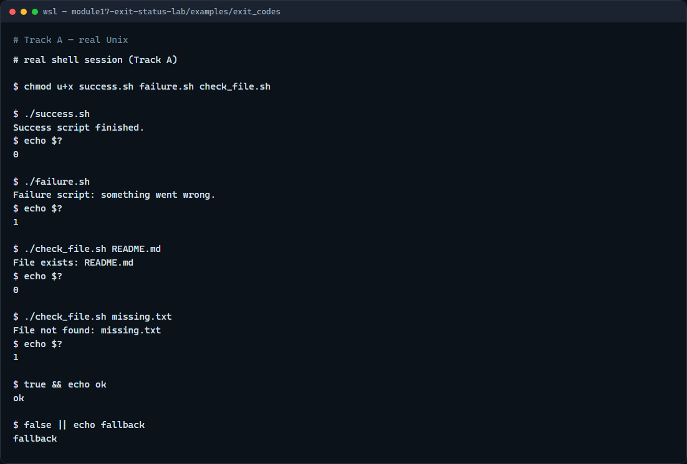

# Exit status and conditional chaining

Every command leaves an exit status

---

## Zero, non-zero, and short-circuit
- Exit zero is the success convention Make, CI, and other scripts rely on
- Non-zero signals an error, often one for a generic fail, two for bad usage
- Dollar-question-mark is the last command’s code
- True and false are tiny commands that exit zero or one so you can practice chaining
- Prefer if for real branches

---

## Browser lab


---

## Real shell practice


---

## Real shell practice — try these

```
# chmod u+x … — make the demo scripts executable
chmod u+x success.sh failure.sh check_file.sh

# ./success.sh — script exits 0 (success)
./success.sh

# echo $? — print exit status of the last command (expect 0)
echo $?

# ./failure.sh — script exits 1 (failure); status still printable after
./failure.sh
echo $?

# ./check_file.sh README.md — exit 0 if the file exists
./check_file.sh README.md
echo $?

# ./check_file.sh missing.txt — exit 1 when the file is absent
./check_file.sh missing.txt
echo $?

# true && echo ok — run echo only if true succeeded
true && echo ok

# false || echo fallback — run echo only if false failed
false || echo fallback

```

---

## Pitfalls to watch
- Check dollar-question-mark immediately, any command, even echo, replaces it
- Do not treat ampersand-ampersand pipe-pipe as a full if-else
- And remember

---

## Your turn
- Complete the checklist for at least one track, preferably both
- In the browser, finish a few challenges after the starter
- On the real shell
- When you are ready, take the short quiz, then continue to safe scripting

