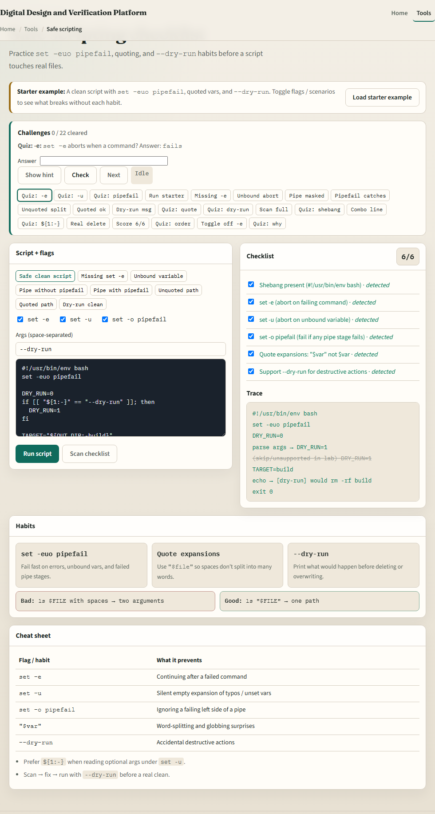
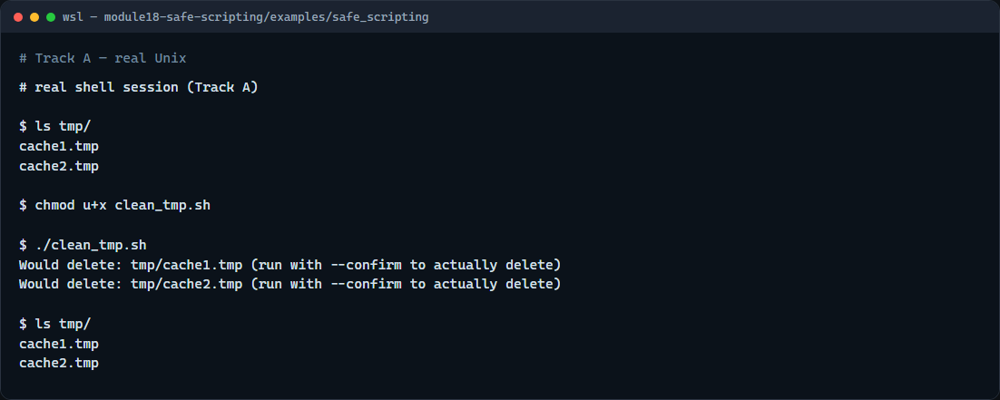

# Module 18 — Safe scripting

**Module id:** module18-safe-scripting  
**Lab:** safe-scripting  
**Tracks:** A · B

## Slide 1 — Safe scripting

Scripts that delete files or stop builds can hurt when they run by accident. Safe scripting means fail fast, quote your variables, and prefer a dry run before a destructive action. This module turns those habits into a checklist you can reuse for clean scripts, CI helpers, and project maintenance.

## Slide 2 — Fail fast, quote, dry-run

Set dash-euo pipefail at the top: dash-e stops on the first failing command, dash-u catches unset variables, and pipefail makes a failing command in a pipe fail the whole pipe. Always quote expansions like dollar-file so spaces do not split paths. For deletes and cleans, print what you would do by default and require an explicit confirm flag before anything is removed. Check that directories exist before you walk them.

## Slide 3 — Browser lab



In the browser lab, load the starter example. You will see set dash-euo pipefail, quoted variables, and a dry-run flag. Toggle the safety checklist, try the unquoted-path scenario, and run a dry-run clean. Orient yourself with the script pane, the flags, and the challenge list, then practice on a real shell.

## Slide 4 — Real shell practice



In the real Unix track, open this module’s safe-scripting example. List the tmp folder so you see the cache files. Make the clean script executable and run it with no flags—it only prints would-delete lines. List tmp again to confirm nothing was removed. When you are sure, you can re-run with confirm to actually delete; do that only when you mean it. You will reuse dry-run-first whenever a script touches build artifacts or logs.

```bash
# ls tmp/ — see the sample cache files before cleaning
ls tmp/

# chmod u+x clean_tmp.sh — make the clean script executable
chmod u+x clean_tmp.sh

# ./clean_tmp.sh — dry run by default (prints Would delete, keeps files)
./clean_tmp.sh

# ls tmp/ — confirm the files are still there
ls tmp/

# ./clean_tmp.sh --confirm — only when ready: actually delete *.tmp
# ./clean_tmp.sh --confirm
```

## Slide 5 — Pitfalls to watch

Unquoted variables break on spaces and can make rm touch the wrong paths. Skipping dry-run on a clean script is how accidents happen. And remember: the browser lab shows the idea; lasting safety still lives in scripts you run carefully on a real shell.

## Slide 6 — Your turn

Complete the checklist for at least one track—preferably both. In the browser, finish a few challenges after the starter. On the real shell, run the dry-run clean and only use confirm when you intend to delete. When you are ready, take the short quiz, then continue to project layout, archives, sed, and diff.
