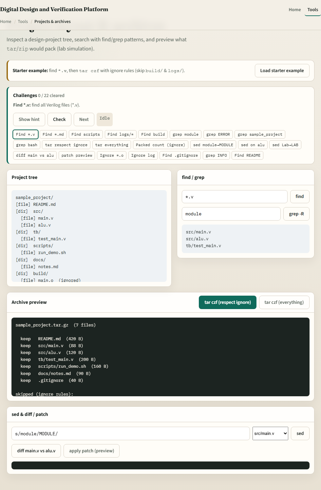
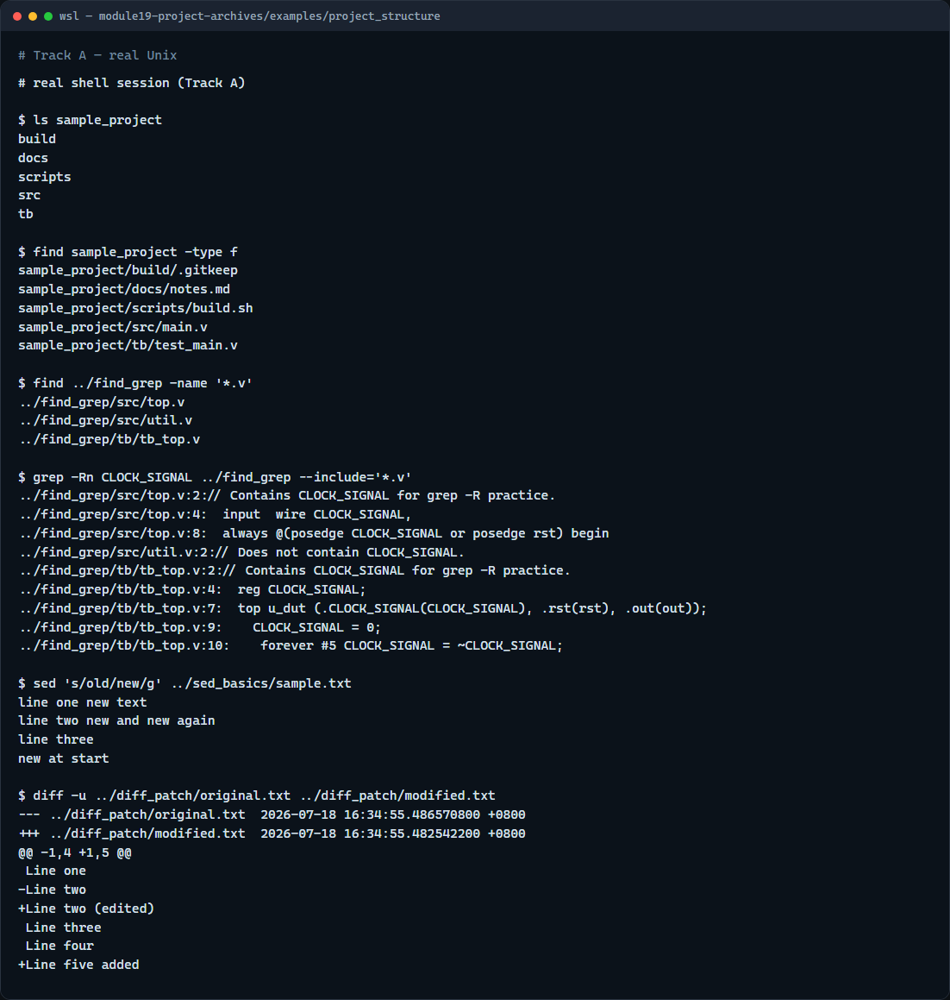

# Module 19 — Project layout, archives, sed & diff

**Module id:** module19-project-archives  
**Lab:** project-archives  
**Tracks:** A · B

## Slide 1 — Project layout, archives, sed and diff

A design project needs a clear tree—source, testbench, docs, scripts, and a build folder for generated noise. Archives should pack the useful files and skip build and logs. Sed does quick stream edits; diff shows what changed so you can review or make a patch. This module ties layout, search, and text tools together before the next module compares tar and zip in depth.

## Slide 2 — Tree, search, edit, compare

Keep RTL under src, tests under tb, notes under docs, helpers under scripts, and generated output under build. Find locates files by name; recursive grep finds a signal across the tree. Sed substitutes on a stream—test without in-place first. Unified diff is the same shape as git diff and feeds patch. When you archive, ignore build and logs so the tarball stays small and shareable.

## Slide 3 — Browser lab



In the browser lab, load the starter example. Find Verilog files, then pack with tar while respecting ignore rules so build and logs are skipped. Try a sed substitution and a diff between two modules. Orient yourself with the project tree, the archive buttons, and the sed-diff panel, then practice on a real shell.

## Slide 4 — Real shell practice



In the real Unix track, open the sample project and list its folders, then find every file in the tree. In the find-grep example, list Verilog files and search recursively for a clock signal name. In sed basics, substitute old with new globally on the sample text. Finish with a unified diff between original and modified. You will reuse this loop—navigate, search, edit, compare—on every chip project.

```bash
# ls / find — inspect sample_project layout
ls sample_project
find sample_project -type f

# find *.v — Verilog files under find_grep
find ../find_grep -name '*.v'

# grep -Rn — recursive content search with line numbers (Verilog only here)
grep -Rn CLOCK_SIGNAL ../find_grep --include='*.v'

# sed 's/old/new/g' — global substitute (stdout only; file unchanged)
sed 's/old/new/g' ../sed_basics/sample.txt

# diff -u — unified diff (patch-friendly)
diff -u ../diff_patch/original.txt ../diff_patch/modified.txt
```

## Slide 5 — Pitfalls to watch

Do not archive build and logs by default—they bloat shares and hide the real sources. Always dry-run sed without in-place before you rewrite a file. And remember: the browser lab shows the idea; lasting project hygiene still lives on a real filesystem.

## Slide 6 — Your turn

Complete the checklist for at least one track—preferably both. In the browser, finish a few challenges after the starter. On the real shell, walk the sample project, practice find and grep, then sed and diff. When you are ready, take the short quiz, then continue to tar versus zip.
