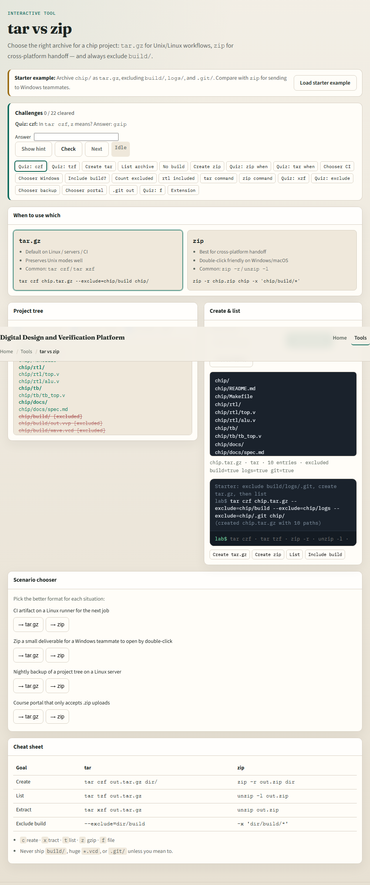
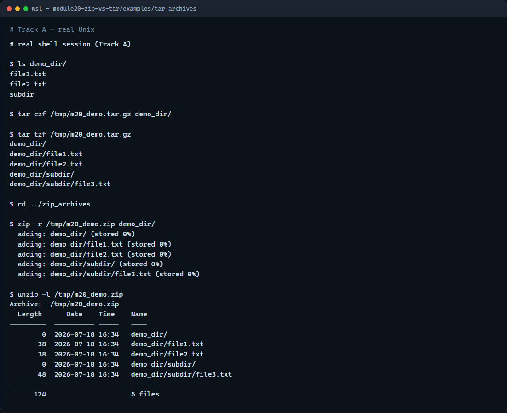

# Module 20 — tar vs zip

**Module id:** module20-zip-vs-tar  
**Lab:** zip-vs-tar  
**Tracks:** A · B

## Slide 1 — tar versus zip

You will ship trees as archives—homework drops, IP handoffs, backup snapshots. On Unix, tar with gzip is the everyday format. Zip is the cross-platform handoff when Windows teammates expect a zip file. This module makes create, list, and extract feel natural for both.

## Slide 2 — Create, list, extract

Tar create with gzip is tar c-z-f, then the archive name, then the directory. List with t-z-f; extract with x-z-f. Zip uses zip dash-r to recurse, unzip dash-l to list, and unzip to extract. Remember: c create, x extract, t list, z gzip, f file. Exclude build and logs when packing a project so the archive stays small.

## Slide 3 — Browser lab



In the browser lab, load the starter example. Pack a chip tree with tar while excluding build, then switch to zip and compare. List the archive without extracting. Orient yourself with the format cards, the exclude checkboxes, and the terminal, try a few challenges, then practice on a real shell.

## Slide 4 — Real shell practice



In the real Unix track, open the tar-archives example. List the demo directory, create a gzipped tar in a temp path, and list the archive contents. Then open the zip-archives example, create a recursive zip of the same kind of tree, and list it with unzip. You will reuse these two recipes whenever you share a project folder.

```bash
# ls demo_dir/ — see the sample tree to pack (tar_archives/)
ls demo_dir/

# tar czf … — create a gzip-compressed tar of demo_dir
tar czf /tmp/m20_demo.tar.gz demo_dir/

# tar tzf … — list archive contents without extracting
tar tzf /tmp/m20_demo.tar.gz

# cd ../zip_archives — switch to the zip example tree
cd ../zip_archives

# zip -r … — create a recursive zip of demo_dir
zip -r /tmp/m20_demo.zip demo_dir/

# unzip -l … — list zip contents without extracting
unzip -l /tmp/m20_demo.zip
```

## Slide 5 — Pitfalls to watch

The f flag’s next argument is the archive filename—put options before the name carefully. Prefer listing before extract so you know what will unpack. And remember: the browser lab shows the idea; lasting handoffs still use real tar and zip on a real shell.

## Slide 6 — Your turn

Complete the checklist for at least one track—preferably both. In the browser, finish a few challenges after the starter. On the real shell, create and list both a tar.gz and a zip. When you are ready, take the short quiz, then continue to backup and clean-build.
