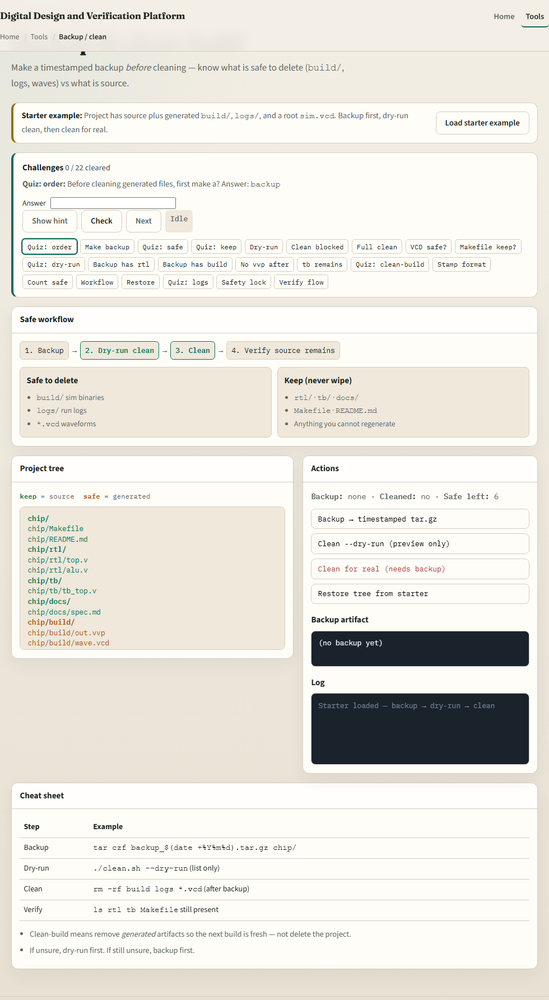
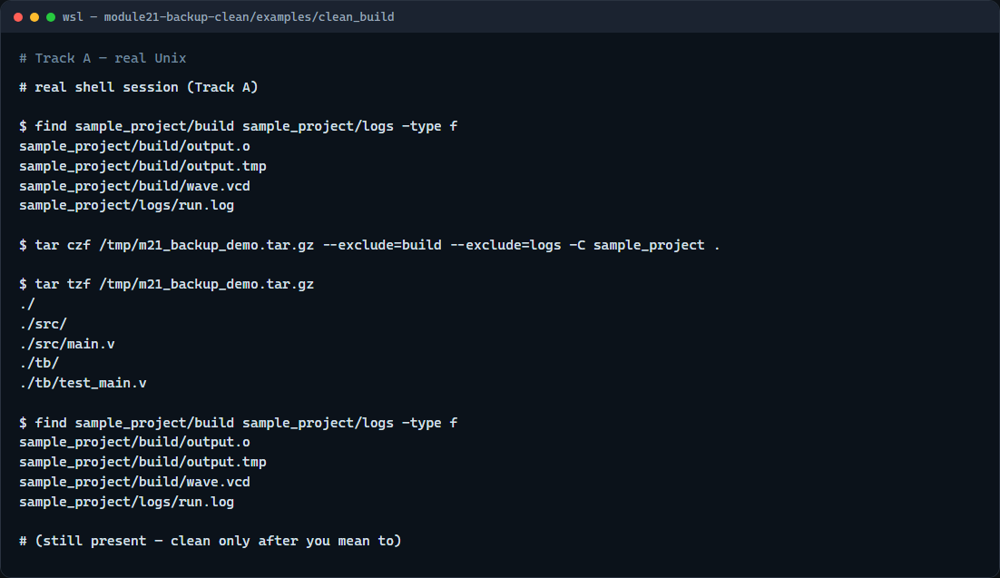

# Backup and clean-build

Build folders and logs grow fast, waveforms, object files, run logs

---

## Timestamp, exclude, then clean
- Name archives with a date stamp so versions do not overwrite each other
- Exclude build and logs from the backup when you only need sources, docs, and scripts
- For clean: list files under build and logs first
- Align exclude patterns with your ignore file so archives and Git stay consistent

---

## Browser lab


---

## Real shell practice


---

## Real shell practice — try these

```
# find … -type f — list generated files under build/ and logs/
find sample_project/build sample_project/logs -type f

# tar czf backup_….tar.gz — timestamped archive excluding build and logs
tar czf /tmp/m21_backup_demo.tar.gz \
  --exclude='build' --exclude='logs' \
  -C sample_project .

# tar tzf … — list what was backed up (no build/logs)
tar tzf /tmp/m21_backup_demo.tar.gz

# find again — dry-run view of clean targets (do not delete yet)
find sample_project/build sample_project/logs -type f

# ./clean.sh — only when ready: delete files in build/ and logs/
# chmod u+x clean.sh && ./clean.sh

```

---

## Pitfalls to watch
- Never clean before you have a backup you can restore
- Do not run recursive delete on a path you have not listed
- And remember

---

## Your turn
- Complete the checklist for at least one track, preferably both
- In the browser, finish the backup → dry-run → clean flow
- On the real shell, make a timestamped archive and list clean targets before you delete
- When you are ready, take the short quiz, then continue to relative symlink pitfalls

