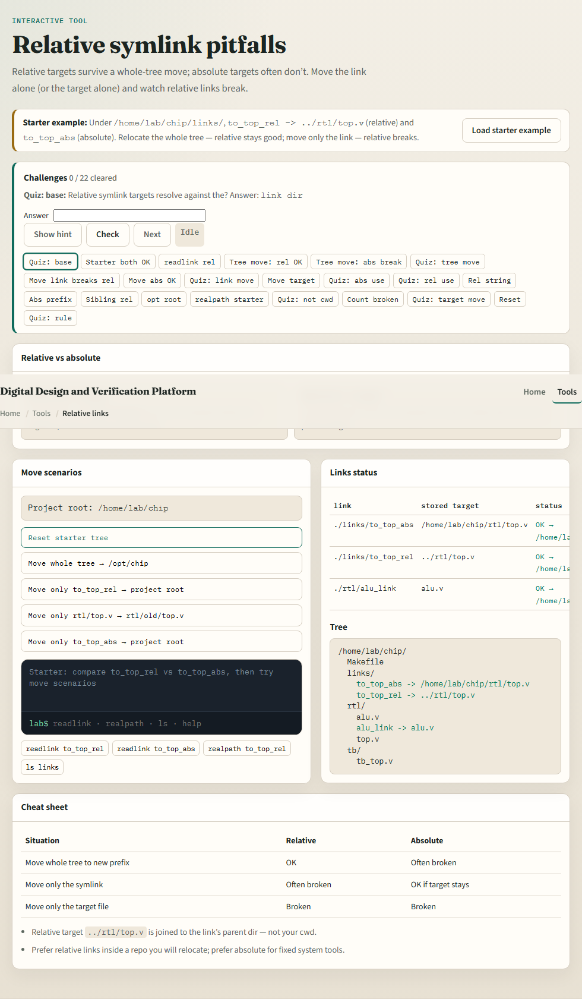
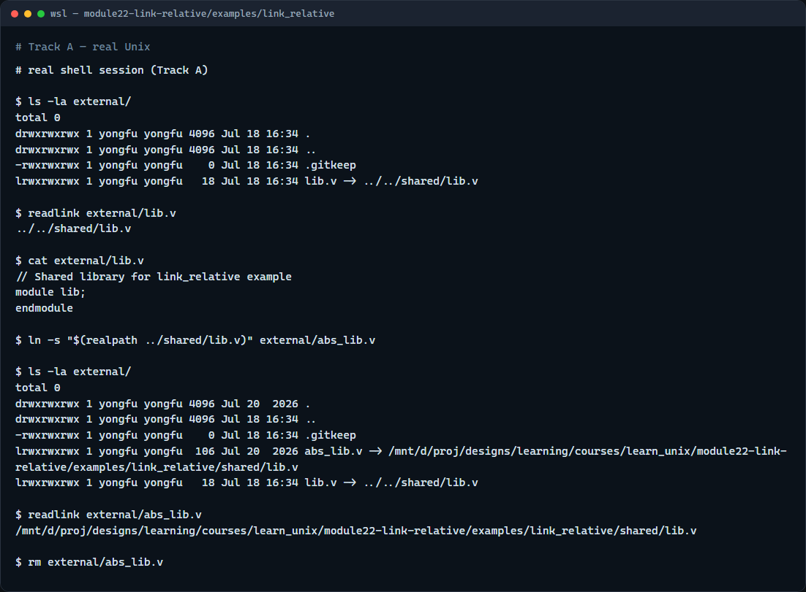

# Module 22 — Relative symlink pitfalls

**Module id:** module22-link-relative  
**Lab:** link-relative  
**Tracks:** A · B

## Slide 1 — Relative symlink pitfalls

Symlinks let a project point at shared IP without copying files. Absolute links break when you move or clone the tree to a new prefix. Relative links store a path from the link’s directory to the target—so the whole repo can relocate and still resolve. This module is about choosing relative links on purpose—and knowing when they still break.

## Slide 2 — Relative to the link, not your cwd

The target string is resolved from the directory that contains the symlink, not from where you ran ln. From project slash external, shared lib is up two levels then shared slash lib. Prefer relative inside a repo you will move; prefer absolute only for fixed system tools. Moving only the symlink to a new folder often breaks a relative link; moving the whole tree usually keeps it.

## Slide 3 — Browser lab



In the browser lab, load the starter example. You get a relative link and an absolute link to the same file. Relocate the whole tree—relative stays good, absolute breaks. Move only the relative link—and watch it break. Orient yourself with the tree, the scenario buttons, and the resolve status, try a few challenges, then practice on a real shell.

## Slide 4 — Real shell practice



In the real Unix track, open the link-relative project. List external to see the symlink arrow to shared lib. Print the link text with readlink, then cat through the link to prove it resolves. Optionally create a short-lived absolute link beside it and compare—remove the absolute one when done. You will reuse relative links whenever shared IP sits beside a project tree in a cloneable layout.

```bash
# ls -la external/ — see lib.v -> ../../shared/lib.v
ls -la external/

# readlink external/lib.v — print the stored relative target
readlink external/lib.v

# cat external/lib.v — follow the link and show shared content
cat external/lib.v

# ln -s "$(realpath …)" — absolute contrast (fixed path; breaks if tree moves)
ln -s "$(realpath ../shared/lib.v)" external/abs_lib.v
readlink external/abs_lib.v

# rm external/abs_lib.v — remove the absolute demo link
rm external/abs_lib.v
```

## Slide 5 — Pitfalls to watch

Count the dots from the link’s directory, not from the repo root by habit. Do not move a relative symlink alone without updating its target string. And remember: the browser lab shows relocate scenarios; lasting shared-IP links still live as relative paths on a real filesystem.

## Slide 6 — Your turn

Complete the checklist for at least one track—preferably both. In the browser, run whole-tree relocate and move-only-link. On the real shell, inspect the external lib link with readlink and cat. When you are ready, take the short quiz, then continue to the pre-push / Make / env checklist.
