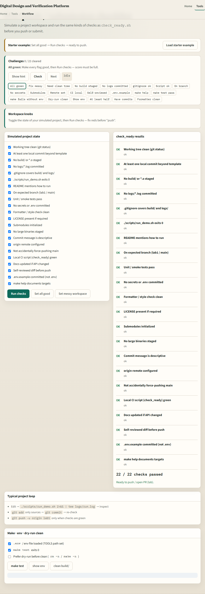
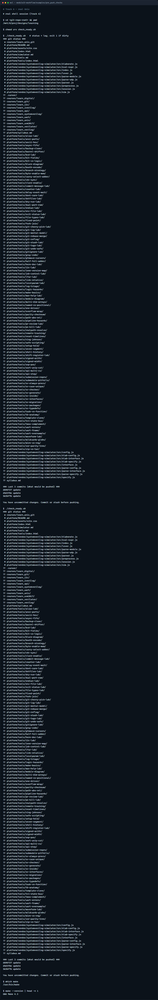

# Module 23 — Pre-push / Make / env checklist

**Module id:** module23-workflow  
**Lab:** workflow  
**Tracks:** A · B

## Slide 1 — Pre-push, Make, and env checklist

Before you push or hand off a build, run a short local checklist: clean tree, recent commits look right, environment variables the tools need are set, and Make or a test script exits zero. This module turns that habit into a reusable pre-push flow—before the next module digs into Makefiles themselves.

## Slide 2 — Status, env, then the green build

Git status shows uncommitted noise—commit or stash before push. A short log confirms what you are about to send. Tools often need a TOOLS path or env file; without it, make test fails even when the code is fine. Prefer dry-run cleans when unsure. Exit zero is the handshake CI and teammates expect.

## Slide 3 — Browser lab



In the browser lab, load the starter example. Tick the pre-push checklist items, toggle env and make-ok, run make test and show env, and try a dry-run clean. Orient yourself with the checklist, the make panel, and the challenge strip, then practice on a real shell.

## Slide 4 — Real shell practice



In the real Unix track, run the pre-push check script from inside a Git repository—your course tree works. It prints a short status and the last few commits, then fails if the working tree is dirty. Glance at make with which and a one-line version check so you know the toolchain is on the path. You will reuse this checklist before every push and CI-bound change.

```bash
# chmod u+x check_ready.sh — make the pre-push helper executable
chmod u+x check_ready.sh

# ./check_ready.sh — status + recent log; exit 1 if dirty (run from a Git repo)
./check_ready.sh

# which make — confirm Make is on PATH
which make

# make --version — one-line toolchain sanity check
make --version | head -n 1
```

## Slide 5 — Pitfalls to watch

Do not push with a dirty tree and hope CI sorts it out. Do not blame the RTL when TOOLS or env was never sourced. And remember: the browser lab shows the checklist idea; lasting discipline still means running checks on a real shell before push.

## Slide 6 — Your turn

Complete the checklist for at least one track—preferably both. In the browser, clear a few challenges after the starter. On the real shell, run check-ready from a clean tree and confirm Make is available. When you are ready, take the short quiz, then continue to Makefile basics.
