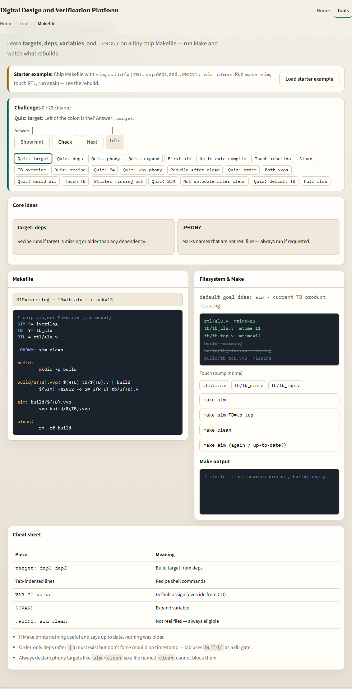
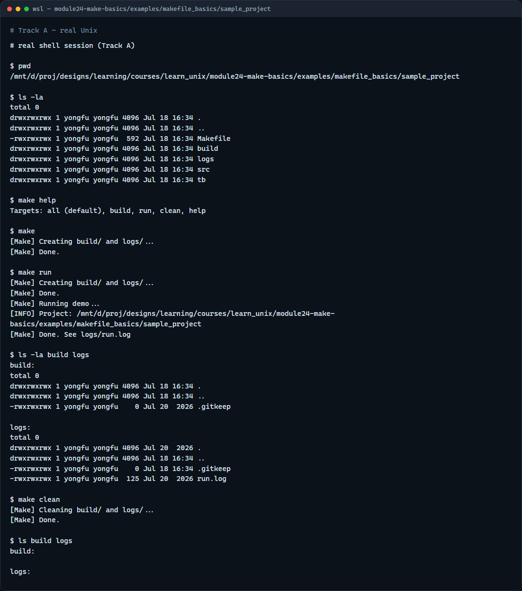

# Makefile basics

Make reads a Makefile and runs named targets

---

## Targets, deps, and .PHONY
- A rule is a target, optional dependencies, then a tab-indented recipe
- Make rebuilds when the target is missing or older than a dependency
- Names like clean are usually marked .PHONY so Make always runs them even if a file with
- Default make often means all or the first target, here, build

---

## Browser lab


---

## Real shell practice


---

## Real shell practice — try these

```
# pwd — print working directory (where am I?)
pwd

# ls -la — list all entries, long format (what is here?)
ls -la

# make help — list available targets
make help

# make — default target (all → build); creates build/ and logs/
make

# make run — depends on build; appends a line to logs/run.log
make run

# ls -la build logs — confirm generated dirs and the run log
ls -la build logs

# make clean — remove generated files under build/ and logs/
make clean

# ls build logs — verify cleanup left the directories tidy
ls build logs

```

---

## Pitfalls to watch
- Run make from the project root so paths in the Makefile resolve
- Recipes must use a real tab, not spaces
- Do not create a file named clean if clean is a phony target, or mark it .PHONY
- And remember

---

## Your turn
- Complete the checklist for at least one track, preferably both
- In the browser, clear a few challenges after the starter
- On the real shell, run help, build, run, and clean in the sample project
- When you are ready, take the short quiz, then continue to the dry-run mindset module

