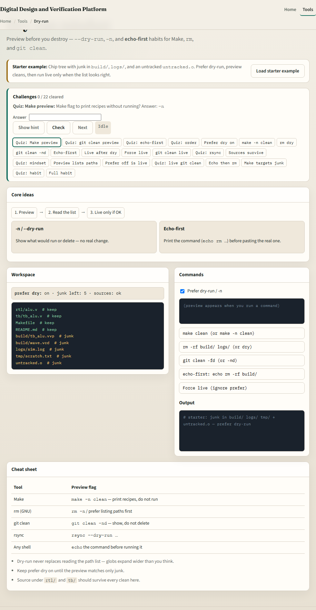
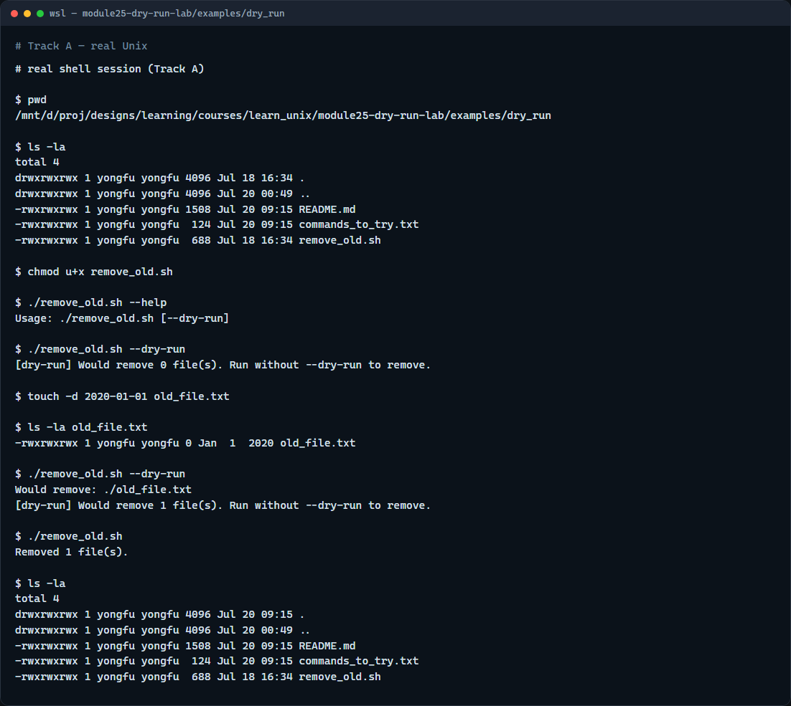

# Dry-run mindset

Before a clean deletes build junk, preview what would change

---

## Preview, read, then live
- Prefer preview first
- Read every path on the list
- Live run only after the list matches what you meant to remove
- Echo-first is the same idea, print the command before you paste the real one

---

## Browser lab


---

## Real shell practice


---

## Real shell practice — try these

```
# pwd — print working directory (where am I?)
pwd

# ls -la — list all entries, long format (what is here?)
ls -la

# chmod u+x remove_old.sh — make the cleanup script executable
chmod u+x remove_old.sh

# ./remove_old.sh --help — show usage (dry-run flag)
./remove_old.sh --help

# ./remove_old.sh --dry-run — preview only; no deletes yet
./remove_old.sh --dry-run

# touch -d 2020-01-01 old_file.txt — create a file older than 365 days
touch -d 2020-01-01 old_file.txt

# ls -la old_file.txt — confirm the stamped file exists
ls -la old_file.txt

# ./remove_old.sh --dry-run — preview would-remove for the old file
./remove_old.sh --dry-run

# ./remove_old.sh — live remove (files older than 365 days)
./remove_old.sh

# ls -la — confirm old_file.txt is gone
ls -la

```

---

## Pitfalls to watch
- Do not run a live clean because dry-run felt slow
- Do not ignore paths you do not recognize on the preview list
- And remember

---

## Your turn
- Complete the checklist for at least one track, preferably both
- In the browser, clear a few challenges after the starter
- On the real shell, dry-run the remove script, then live-run only when the list looks right
- When you are ready, take the short quiz, then continue to log and failure triage

