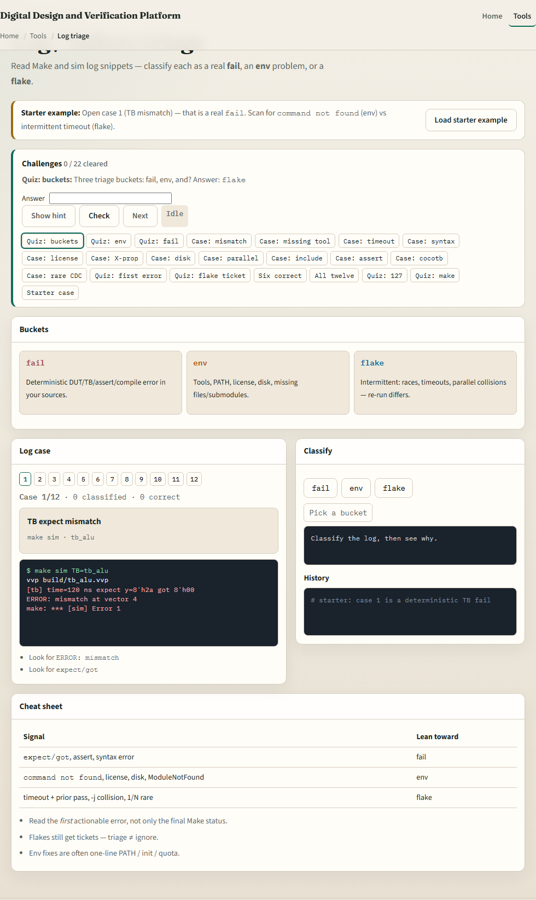
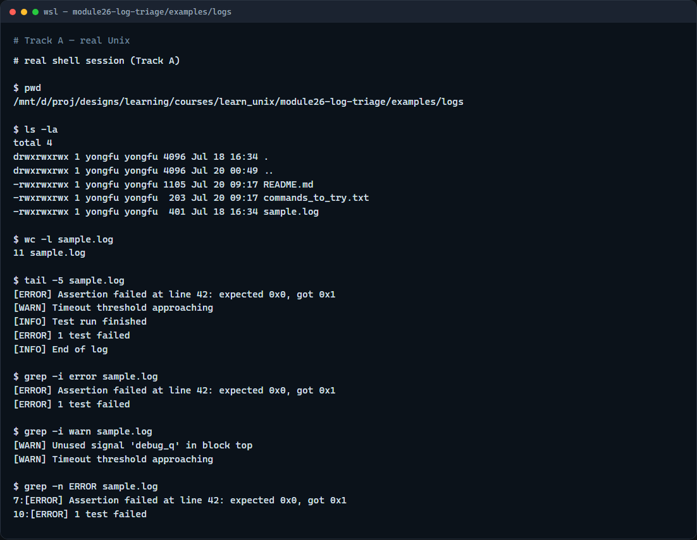

# Log and failure triage

When make sim fails, the log is your first stop, not a random rewrite of the RTL

---

## Tail, grep, then classify
- Start with the last lines, tail shows where the run stopped
- Grep for error and warn, case-insensitive, so you do not miss mixed case
- Ask: is this expect-got in the testbench
- Classification decides whether you fix RTL, fix env, or chase timing

---

## Browser lab


---

## Real shell practice


---

## Real shell practice — try these

```
# pwd — print working directory (where am I?)
pwd

# ls -la — list all entries, long format (what is here?)
ls -la

# wc -l sample.log — count lines in the sample log
wc -l sample.log

# tail -5 sample.log — show the last five lines (how did it end?)
tail -5 sample.log

# grep -i error sample.log — find error lines, case-insensitive
grep -i error sample.log

# grep -i warn sample.log — find warn lines, case-insensitive
grep -i warn sample.log

# grep -n ERROR sample.log — ERROR matches with line numbers
grep -n ERROR sample.log

```

---

## Pitfalls to watch
- Do not rewrite RTL when the log says command not found
- Do not ignore warn lines that foreshadow a timeout
- And remember

---

## Your turn
- Complete the checklist for at least one track, preferably both
- In the browser, classify a few fail, env, and flake cases after the starter
- On the real shell, triage the sample log with tail and grep
- When you are ready, take the short quiz, then continue to env-file literacy

