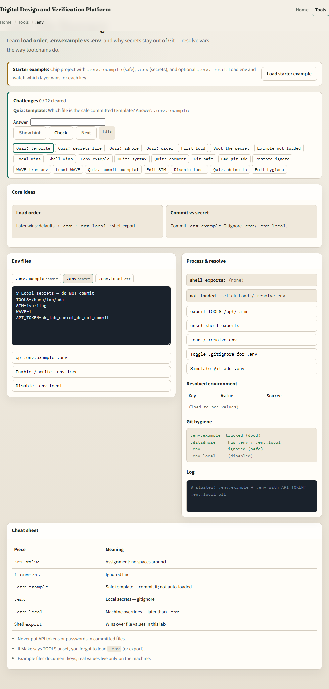
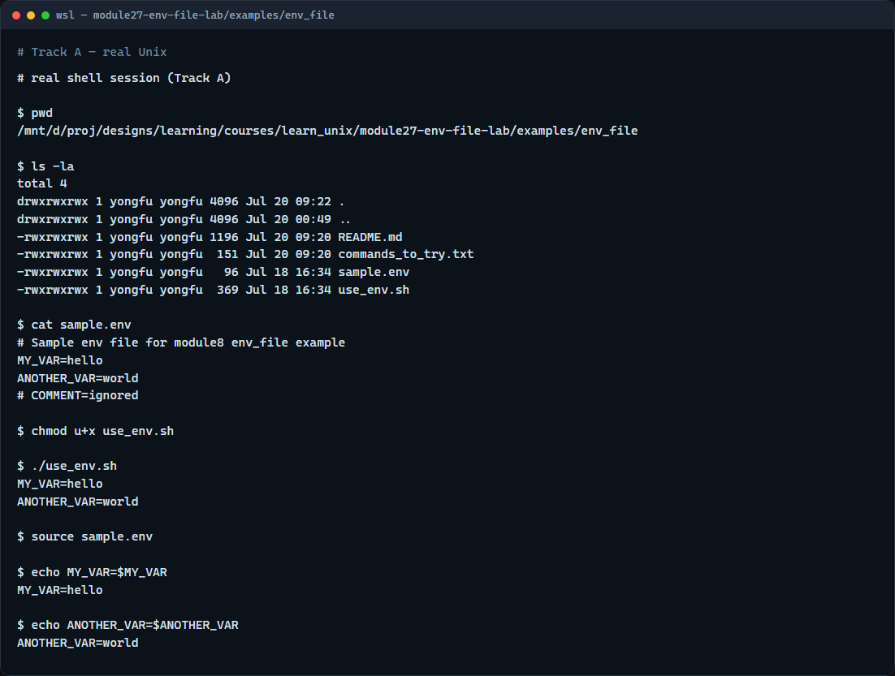

# Dot-env literacy

Toolchains need paths and flags, TOOLS, SIM, WAVE, without hard-coding secrets in scripts you commit

---

## Source, layers, and Git
- Source or dot loads the file into the current shell
- Commit a safe example template; keep the real env file gitignored
- Later layers win, local overrides, then shell exports
- Never commit tokens or private paths; document the keys teammates must set

---

## Browser lab


---

## Real shell practice


---

## Real shell practice — try these

```
# pwd — print working directory (where am I?)
pwd

# ls -la — list all entries, long format (what is here?)
ls -la

# cat sample.env — show KEY=value lines (and comments)
cat sample.env

# chmod u+x use_env.sh — make the helper script executable
chmod u+x use_env.sh

# ./use_env.sh — source sample.env inside the script and print vars
./use_env.sh

# source sample.env — load vars into the current shell
source sample.env

# echo MY_VAR=... — confirm MY_VAR is set after sourcing
echo MY_VAR=$MY_VAR

# echo ANOTHER_VAR=... — confirm ANOTHER_VAR is set
echo ANOTHER_VAR=$ANOTHER_VAR

```

---

## Pitfalls to watch
- Do not commit a real env file with secrets
- Do not put spaces around the equals sign in KEY equals value lines
- And remember

---

## Your turn
- Complete the checklist for at least one track, preferably both
- In the browser, clear a few challenges after the starter
- On the real shell, source the sample env and confirm the variables print
- When you are ready, take the short quiz, then continue to the course wrap

